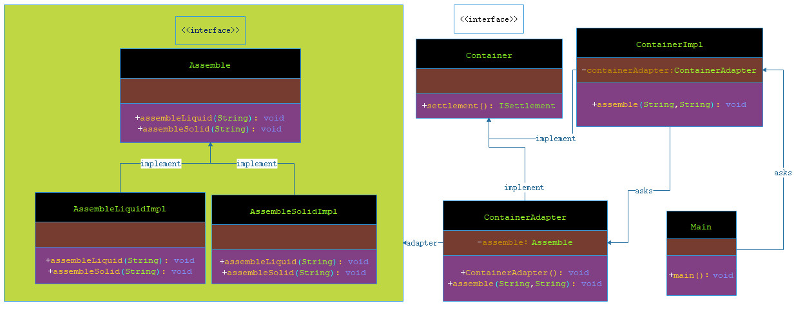

# 适配器模式

***

###### 适配器模式（Adapter Pattern）是作为两个不兼容的接口之间的桥梁。这种类型的设计模式属于结构型模式，它结合了两个独立接口的功能。

###### 这种模式涉及到一个单一的类，该类负责加入独立的或不兼容的接口功能。举个真实的例子，读卡器是作为内存卡和笔记本之间的适配器。您将内存卡插入读卡器，再将读卡器插入笔记本，这样就可以通过笔记本来读取内存卡。
###### 我们通过下面的实例来演示适配器模式的使用。其中，液体用瓶子装，固体使用篮子装，通过使用一个更高级的容器来适配固体和液体。

***

## 介绍

- **意图**：将一个类的接口转换成客户希望的另外一个接口。适配器模式使得原本由于接口不兼容而不能一起工作的那些类可以一起工作。

- **主要解决**：主要解决在软件系统中，常常要将一些"现存的对象"放到新的环境中，而新环境要求的接口是现对象不能满足的。

- **何时使用**：

> 1、系统需要使用现有的类，而此类的接口不符合系统的需要。 

>2、想要建立一个可以重复使用的类，用于与一些彼此之间没有太大关联的一些类，包括一些可能在将来引进的类一起工作，这些源类不一定有一致的接口。 

> 3、通过接口转换，将一个类插入另一个类系中。（比如老虎和飞禽，现在多了一个飞虎，在不增加实体的需求下，增加一个适配器，在里面包容一个虎对象，实现飞的接口。）

- **如何解决**：继承或依赖（推荐）。

- **关键代码**：适配器继承或依赖已有的对象，实现想要的目标接口。

- **应用实例**： 

> 1、美国电器 110V，中国 220V，就要有一个适配器将 110V 转化为 220V。 

> 2、JAVA JDK 1.1 提供了 Enumeration 接口，而在 1.2 中提供了 Iterator 接口，想要使用 1.2 的 JDK，则要将以前系统的 Enumeration 接口转化为 Iterator 接口，这时就需要适配器模式。 

> 3、在 LINUX 上运行 WINDOWS 程序。 

> 4、JAVA 中的 jdbc。

- **优点**： 

> 1、可以让任何两个没有关联的类一起运行。 

> 2、提高了类的复用。 

> 3、增加了类的透明度。 

> 4、灵活性好。

- **缺点**： 

> 1、过多地使用适配器，会让系统非常零乱，不易整体进行把握。比如，明明看到调用的是 A 接口，其实内部被适配成了 B 接口的实现，一个系统如果太多出现这种情况，无异于一场灾难。因此如果不是很有必要，可以不使用适配器，而是直接对系统进行重构。 

> 2.由于 JAVA 至多继承一个类，所以至多只能适配一个适配者类，而且目标类必须是抽象类。

- **使用场景**：有动机地修改一个正常运行的系统的接口，这时应该考虑使用适配器模式。

- **注意事项**：适配器不是在详细设计时添加的，而是解决正在服役的项目的问题。

***

## 实现
###### 我们有一个 Container 接口和一个实现了 Container 接口的实体类 ContainerImpl。Container 目前只能盛放液体和固体两种状态的物品，

###### 我们还有另一个接口 Assemble 和实现了 Assemble 接口的实体类。该类可以盛放液体和固体。

###### 我们想要让 Container 可以根据液体状态自动选择容器。为了实现这个功能，我们需要创建一个实现了 Container 接口的适配器类 ContainerAdapter，并使用 Assemble 对象来盛放不同状态的物品。

###### ContainerImpl 使用适配器类 ContainerAdapter 传递所盛放物体的状态，不需要知道能盛放什么样状态的物体的实际类。Main，我的演示类使用 ContainerImpl 类来盛放不同的物体。



> 步骤 1：盛放容器和盛放处理的接口。

**Container.java**
 
```markdown

    package com.dao.pattern.adapter.interfaces;
    
    /**
     * 容器
     *
     * @author 阿导
     * @version 1.0
     * @fileName com.dao.pattern.adapter.interfaces.Container.java
     * @CopyRright (c) 2018-万物皆导
     * @created 2018-03-21 15:20:00
     */
    public interface Container {
    
        /**
         * 用容器装物体
         *
         * @author 阿导
         * @time 2018/3/21
         * @CopyRight 万物皆导
         * @param type 物体性质
         * @param name 物体名称
         * @return void
         */
        void assemble(String type,String name);
    
    }
    
    
```

**Assemble.java**
 
```markdown   
    
    package com.dao.pattern.adapter.interfaces;
    
    /**
     * 盛放，装载
     *
     * @author 阿导
     * @version 1.0
     * @fileName com.dao.pattern.adapter.interfaces.Assemble.java
     * @CopyRright (c) 2018-万物皆导
     * @created 2018-03-21 15:22:00
     */
    public interface Assemble {
        /**
         * 装液体
         *
         * @author 阿导
         * @time 2018/3/21
         * @CopyRight 万物皆导
         * @param name
         * @return void
         */
        void assembleLiquid(String name);
        /**
         * 装固体
         *
         * @author 阿导
         * @time 2018/3/21
         * @CopyRight 万物皆导
         * @param name
         * @return void
         */
        void assembleSolid(String name);
    }


```
> 步骤 2：创建实现了 Assemble 接口的实体类。

**AssembleLiquidImpl.java**
 
```markdown
    
    package com.dao.pattern.adapter.impl;
    
    import com.dao.pattern.adapter.interfaces.Assemble;
    
    /**
     * 液体适配
     *
     * @author 阿导
     * @version 1.0
     * @fileName com.dao.pattern.adapter.impl.AssembleLiquidImpl.java
     * @CopyRright (c) 2018-万物皆导
     * @created 2018-03-21 15:28:00
     */
    public class AssembleLiquidImpl implements Assemble{
    
        /**
         * 装液体
         *
         * @param name
         * @return void
         * @author 阿导
         * @time 2018/3/21
         * @CopyRight 万物皆导
         */
        public void assembleLiquid(String name) {
            System.out.println(name.concat("是液体，请装在玻璃瓶"));
        }
    
        /**
         * 装固体
         *
         * @param name
         * @return void
         * @author 阿导
         * @time 2018/3/21
         * @CopyRight 万物皆导
         */
        public void assembleSolid(String name) {
            //什么也不做
        }
    }
    
```

**AssembleSolidImpl.java**

```markdown
    
    package com.dao.pattern.adapter.impl;
    
    import com.dao.pattern.adapter.interfaces.Assemble;
    
    /**
     * 固体适配
     *
     * @author 阿导
     * @version 1.0
     * @fileName com.dao.pattern.adapter.impl.AssembleSolidImpl.java
     * @CopyRright (c) 2018-万物皆导
     * @created 2018-03-21 15:29:00
     */
    public class AssembleSolidImpl implements Assemble {
    
        /**
         * 装液体
         *
         * @param name
         * @return void
         * @author 阿导
         * @time 2018/3/21
         * @CopyRight 万物皆导
         */
        public void assembleLiquid(String name) {
            //什么也不做
        }
    
        /**
         * 装固体
         *
         * @param name
         * @return void
         * @author 阿导
         * @time 2018/3/21
         * @CopyRight 万物皆导
         */
        public void assembleSolid(String name) {
            System.out.println(name.concat("是固体，请装在篮子里面"));
        }
    }

```

> 步骤 3：创建实现了 Container 接口的适配器类。

**ContainerAdapter.java**

```markdown

    package com.dao.pattern.adapter.core;
    
    import com.dao.pattern.adapter.impl.AssembleLiquidImpl;
    import com.dao.pattern.adapter.impl.AssembleSolidImpl;
    import com.dao.pattern.adapter.interfaces.Assemble;
    import com.dao.pattern.adapter.interfaces.Container;
    
    /**
     * Container 接口的适配器类
     *
     * @author 阿导
     * @version 1.0
     * @fileName com.dao.pattern.adapter.core.ContainerAdapter.java
     * @CopyRright (c) 2018-万物皆导
     * @created 2018-03-21 15:37:00
     */
    public class ContainerAdapter implements Container {
    
        /**
         * 用什么容器去装物体
         */
        private Assemble assemble;
        /**
         * 构造方法， * @param null
         * @author 阿导
         * @time 2018/3/21
         * @CopyRight 万物皆导
         * @param type
         * @return
         */
        public ContainerAdapter(String type) {
            if("liquid".equalsIgnoreCase(type)){
                //实例化液体适配器
                assemble=new AssembleLiquidImpl();
            }else if("solid".equalsIgnoreCase(type)){
                //实例化固体适配器
                assemble=new AssembleSolidImpl();
            }
        }
    
        /**
         * 用容器装物体
         *
         * @param type 物体性质
         * @param name 物体名称
         * @return void
         * @author 阿导
         * @time 2018/3/21
         * @CopyRight 万物皆导
         */
        public void assemble(String type, String name) {
            if("liquid".equalsIgnoreCase(type)){
                //液体盛放
                assemble.assembleLiquid(name);
            }else if("solid".equalsIgnoreCase(type)){
                //固体盛放
                assemble.assembleSolid(name);
            }
        }
    }

```

> 步骤 4：创建实现了 Container 接口的实体类。

**ContainerImpl.java**
 
```markdown
    
    package com.dao.pattern.adapter.core;
    
    import com.dao.pattern.adapter.interfaces.Container;
    
    import java.util.Arrays;
    
    /**
     * 容器实现
     *
     * @author 阿导
     * @version 1.0
     * @fileName com.dao.pattern.adapter.core.ContainerImpl.java
     * @CopyRright (c) 2018-万物皆导
     * @created 2018-03-21 15:46:00
     */
    public class ContainerImpl implements Container {
    
        private ContainerAdapter containerAdapter;
        /**
         * 用容器装物体
         *
         * @param type 物体性质
         * @param name 物体名称
         * @return void
         * @author 阿导
         * @time 2018/3/21
         * @CopyRight 万物皆导
         */
        public void assemble(String type, String name) {
            if (Arrays.asList(new String[]{"liquid","solid"}).contains(type)) {
                //调用适配器
                containerAdapter=new ContainerAdapter(type);
                //根据适配调用不同的实现
                containerAdapter.assemble(type,name);
            }else{
                System.out.println("其他状态的物体暂时无处可放！".concat("["+name+"]"));
            }
        }
    }

```

> 步骤 5：使用 ContainerImpl 来盛放不同状态的物品。

**Main.java**
 
```markdown

    package com.dao.pattern.adapter.main;
    
    import com.dao.pattern.adapter.core.ContainerImpl;
    import com.dao.pattern.adapter.interfaces.Container;
    
    /**
     * 主方法入口
     *
     * @author 阿导
     * @version 1.0
     * @fileName com.dao.pattern.adapter.main.Main.java
     * @CopyRright (c) 2018-万物皆导
     * @created 2018-03-21 15:55:00
     */
    public class Main {
        /**
         * 主方法入口
         *
         * @author 阿导
         * @time 2018/3/21
         * @CopyRight 万物皆导
         * @param args
         * @return void
         */
        public static void main(String[] args){
            Container container=new ContainerImpl();
    
            container.assemble("liquid","水");
            container.assemble("solid","石头");
            container.assemble("gas","氧气");
        }
    
    }

```

> 步骤 6：验证输出。

```markdown

  水是液体，请装在玻璃瓶
  石头是固体，请装在篮子里面
  其他状态的物体暂时无处可放！[氧气]

```
