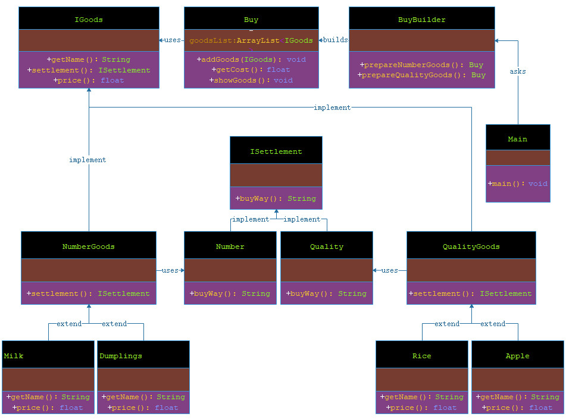

# 建造者模式

***

###### 建造者模式（Builder Pattern）使用多个简单的对象一步一步构建成一个复杂的对象。这种类型的设计模式属于创建型模式，它提供了一种创建对象的最佳方式。
###### 一个 Builder 类会一步一步构造最终的对象。该 Builder 类是独立于其他对象的。
***

## 介绍

- **意图**：将一个复杂的构建与其表示相分离，使得同样的构建过程可以创建不同的表示。

- **主要解决**：主要解决在软件系统中，有时候面临着"一个复杂对象"的创建工作，其通常由各个部分的子对象用一定的算法构成；由于需求的变化，这个复杂对象的各个部分经常面临着剧烈的变化，但是将它们组合在一起的算法却相对稳定。

- **何时使用**：一些基本部件不会变，而其组合经常变化的时候。

- **如何解决**：将变与不变分离开。

- **关键代码**：

> 建造者：创建和提供实例，

> 导演：管理建造出来的实例的依赖关系。

- **应用实例**：

> 1、去肯德基，汉堡、可乐、薯条、炸鸡翅等是不变的，而其组合是经常变化的，生成出所谓的"套餐"。

> 2、JAVA 中的 StringBuilder。

- **优点**：

> 1、建造者独立，易扩展。 

> 2、便于控制细节风险。

- **缺点**：

> 1、产品必须有共同点，范围有限制。

> 2、如内部变化复杂，会有很多的建造类。

- **使用场景**：

> 1、需要生成的对象具有复杂的内部结构。

> 2、需要生成的对象内部属性本身相互依赖。

- **注意事项**：与工厂模式的区别是：建造者模式更加关注与零件装配的顺序。
***

## 实现

###### 我假设在超市买东西，一般在超市买东西分成按数量（Number）结算，或者按质量（Quality）结算.按数量结算的比如牛奶（Milk）、水饺（Dumplings）;还有按质量结算的，比如大米（Rice）、苹果（Apple）。

###### 我将创建一个表示商品（IGoods）的接口，和实现 IGoods 接口的实体(GoodsImpl)，以及商品结算的接口 ISettlement以及结算的实现类（SettlementImpl）.

###### 然后我创建一个 Buy 类，带有 IGoods 的 ArrayList 和一个通过结合 IGoods 来创建不同类型的 Buy 对象的 BuyBuilder。Main是我的启动类，演示类使用 BuyBuilder 来创建一个 Buy。



> 步骤 1：创建一个表示商品和商品结算方式的接口。

**IGoods.java**

```markdown
    
    package com.dao.pattern.builder.interfaces;
    
    /**
     * 商品接口
     *
     * @author 阿导
     * @version BUILD1001
     * @fileName com.dao.pattern.builder.interfaces.IGoods.java
     * @CopyRright (c) 2018-万物皆导
     * @created 2018-02-05 16:25:00
     * @modifier 阿导
     */
    public interface IGoods {
        /**
         * 商品名称
         *
         * @author 阿导
         * @time 2018/2/5
         * @CopyRight 万物皆导
         * @return java.lang.String
         */
        String getName();
    
        /**
         * 结算类型
         *
         * @author 阿导
         * @time 2018/2/5
         * @CopyRight 万物皆导
         * @param
         * @return com.dao.pattern.builder.interfaces.ISettlement
         */
        ISettlement settlement();
    
        /**
         * 商品价格
         *
         * @author 阿导
         * @time 2018/2/5
         * @CopyRight 万物皆导
         * @param
         * @return float
         */
        float price();
    }

```


**ISettlement**

```markdown
    
    package com.dao.pattern.builder.interfaces;
    
    /**
     * 结算接口
     *
     * @author 阿导
     * @version BUILD1001
     * @fileName com.dao.pattern.builder.interfaces.ISettlement.java
     * @CopyRright (c) 2018-万物皆导
     * @created 2018-02-05 16:25:00
     * @modifier 阿导
     */
    public interface ISettlement {
        /**
         * 返回结算方式内心独白
         *
         * @author 阿导
         * @time 2018/2/5
         * @CopyRight 万物皆导
         * @param
         * @return java.lang.String
         */
        String buyWay();
    }

```

> 步骤 2：创建实现结算类型 ISettlement 接口的实现类。

**Number.java**

```markdown
    
    package com.dao.pattern.builder.impl;
    
    import com.dao.pattern.builder.interfaces.ISettlement;
    
    /**
     * 按数量结算
     *
     * @author 阿导
     * @version BUILD1001
     * @fileName com.dao.pattern.builder.impl.Number.java
     * @CopyRright (c) 2018-万物皆导
     * @created 2018-02-05 16:34:00
     * @modifier 阿导
     */
    public class Number implements ISettlement {
        /**
         * 返回数量结算的类型的内心独白
         *
         * @author 阿导
         * @time 2018/2/5
         * @CopyRight 万物皆导
         * @return java.lang.String
         */
        @Override
        public String buyWay() {
            return "多少钱？数一数就知道";
        }
    }

```

**Quality.java**

```markdown
    
    package com.dao.pattern.builder.impl;
    
    import com.dao.pattern.builder.interfaces.ISettlement;
    
    /**
     * 按质量结算
     *
     * @author 阿导
     * @version BUILD1001
     * @fileName com.dao.pattern.builder.impl.Quality.java
     * @CopyRright (c) 2018-万物皆导
     * @created 2018-02-05 16:34:00
     * @modifier 阿导
     */
    public class Quality implements ISettlement{
        /**
         * 返回质量结算的类型的内心独白
         *
         * @author 阿导
         * @time 2018/2/5
         * @CopyRight 万物皆导
         * @return java.lang.String
         */
        @Override
        public String buyWay() {
            return "多少钱？称一称就知道。";
        }
    }

```

> 步骤 3：创建实现商品 IGoods 接口的抽象类，该类提供了默认的功能。

**NumberGoods.java**

```markdown
    
    package com.dao.pattern.builder.impl;
    
    import com.dao.pattern.builder.interfaces.IGoods;
    import com.dao.pattern.builder.interfaces.ISettlement;
    
    /**
     * 按数量卖的商品
     *
     * @author 阿导
     * @version BUILD1001
     * @fileName com.dao.pattern.builder.impl.NumberGoods.java
     * @CopyRright (c) 2018-万物皆导
     * @created 2018-02-05 17:17:00
     * @modifier 阿导
     */
    public abstract class NumberGoods implements IGoods {
    
        /**
         * 返回数量结算的类型
         *
         * @author 阿导
         * @time 2018/2/5
         * @CopyRight 万物皆导
         * @return com.dao.pattern.builder.interfaces.ISettlement
         */
        @Override
        public ISettlement settlement() {
            return new Number();
        }
    }

```

**QualityGoods.java**

```markdown
    
    package com.dao.pattern.builder.impl;
    
    import com.dao.pattern.builder.interfaces.IGoods;
    import com.dao.pattern.builder.interfaces.ISettlement;
    
    /**
     * 按质量卖的商品
     *
     * @author 阿导
     * @version BUILD1001
     * @fileName com.dao.pattern.builder.impl.QualityGoods.java
     * @CopyRright (c) 2018-万物皆导
     * @created 2018-02-05 17:17:00
     * @modifier 阿导
     */
    public abstract class QualityGoods implements IGoods {
    
        /**
         * 返回质量结算的类型
         *
         * @author 阿导
         * @time 2018/2/5
         * @CopyRight 万物皆导
         * @return com.dao.pattern.builder.interfaces.ISettlement
         */
        @Override
        public ISettlement settlement() {
            return new Quality();
        }
    }

```

> 步骤 4：创建扩展了 NumberGoods 和 QualityGoods 的实体类。

**Dumplings.java**

```markdown
    
    package com.dao.pattern.builder.extend;
    
    import com.dao.pattern.builder.impl.NumberGoods;
    
    /**
     * 按数量结算的商品：水饺
     *
     * @author 阿导
     * @version BUILD1001
     * @fileName com.dao.pattern.builder.extend.Dumplings.java
     * @CopyRright (c) 2018-万物皆导
     * @created 2018-02-05 17:21:00
     * @modifier 阿导
     */
    public class Dumplings extends NumberGoods{
        /**
         * 返回水饺的内心独白
         *
         * @author 阿导
         * @time 2018/2/5
         * @CopyRight 万物皆导
         * @return java.lang.String
         */
        @Override
        public String getName() {
            return "我是按数量结算的商品：水饺【一袋水饺】";
        }
        /**
         * 返回水饺的单价
         *
         * @author 阿导
         * @time 2018/2/5
         * @CopyRight 万物皆导
         * @param
         * @return float
         */
        @Override
        public float price() {
            return 8.30F;
        }
    }

```

**Milk.java**

```markdown
    
    package com.dao.pattern.builder.extend;
    
    import com.dao.pattern.builder.impl.NumberGoods;
    
    /**
     * 按数量结算的商品：牛奶
     *
     * @author 阿导
     * @version BUILD1001
     * @fileName com.dao.pattern.builder.extend.Milk.java
     * @CopyRright (c) 2018-万物皆导
     * @created 2018-02-05 17:21:00
     * @modifier 阿导
     */
    public class Milk extends NumberGoods {
        /**
         * 返回牛奶的内心独白
         *
         * @author 阿导
         * @time 2018/2/5
         * @CopyRight 万物皆导
         * @return java.lang.String
         */
        @Override
        public String getName() {
            return "我是按数量结算的商品：牛奶【一瓶牛奶】";
        }
        /**
         * 返回牛奶的单价
         *
         * @author 阿导
         * @time 2018/2/5
         * @CopyRight 万物皆导
         * @param
         * @return float
         */
        @Override
        public float price() {
            return 5.80F;
        }
    }

```

**Apple.java**

```markdown
    
    package com.dao.pattern.builder.extend;
    
    import com.dao.pattern.builder.impl.QualityGoods;
    
    /**
     * 按质量结算的商品：苹果
     *
     * @author 阿导
     * @version BUILD1001
     * @fileName com.dao.pattern.builder.extend.Apple.java
     * @CopyRright (c) 2018-万物皆导
     * @created 2018-02-05 17:23:00
     * @modifier 阿导
     */
    public class Apple extends QualityGoods{
        /**
         * 返回苹果的内心独白
         *
         * @author 阿导
         * @time 2018/2/5
         * @CopyRight 万物皆导
         * @return java.lang.String
         */
        @Override
        public String getName() {
            return "我是按质量结算的商品：苹果【一斤苹果】";
        }
    
        /**
         * 返回苹果的单价
         *
         * @author 阿导
         * @time 2018/2/5
         * @CopyRight 万物皆导
         * @param
         * @return float
         */
        @Override
        public float price() {
            return 5.35F;
        }
    }

```

**Rice.java**

```markdown
    
    package com.dao.pattern.builder.extend;
    
    import com.dao.pattern.builder.impl.QualityGoods;
    
    /**
     * 按质量结算的商品：大米
     *
     * @author 阿导
     * @version BUILD1001
     * @fileName com.dao.pattern.builder.extend.Rice.java
     * @CopyRright (c) 2018-万物皆导
     * @created 2018-02-05 17:22:00
     * @modifier 阿导
     */
    public class Rice extends QualityGoods {
        /**
         * 返回大米的内心独白
         *
         * @author 阿导
         * @time 2018/2/5
         * @CopyRight 万物皆导
         * @return java.lang.String
         */
        @Override
        public String getName() {
            return "我是按质量结算的商品：大米【十斤大米】";
        }
        /**
         * 返回十斤大米价格
         *
         * @author 阿导
         * @time 2018/2/5
         * @CopyRight 万物皆导
         * @param
         * @return float
         */
        @Override
        public float price() {
            return 65.88F;
        }
    }

```

> 步骤 5：创建一个 Buy 类，带有上面定义的 IGoods 对象。

**Buy.java**

```markdown
    
    package com.dao.pattern.builder.core;
    
    import com.dao.pattern.builder.interfaces.IGoods;
    
    import java.util.ArrayList;
    import java.util.List;
    
    /**
     * 购买商品
     *
     * @author 阿导
     * @version BUILD1001
     * @fileName com.dao.pattern.builder.extend.Apple.java
     * @CopyRright (c) 2018-万物皆导
     * @created 2018-02-05 17:23:00
     * @modifier 阿导
     */
    
    public class Buy {
       private List<IGoods> goodsList = new ArrayList<IGoods>();
    
       public void addGoods(IGoods goods){
          goodsList.add(goods);
       }
    
       public float getCost(){
          float cost = 0.0f;
          for (IGoods goods : goodsList) {
             cost += goods.price();
          }        
          return cost;
       }
    
       public void showGoods(){
          for (IGoods goods : goodsList) {
             System.out.println("============================");
             System.out.println("商品的独白: "+goods.getName());
             System.out.println("结算方式: "+goods.settlement().buyWay());
             System.out.println("商品的价格: "+goods.price());
             System.out.println("============================");
          }        
       }    
    }

```

> 步骤 6：创建一个 BuyBuilder 类，实际的 builder 类负责创建 Buy 对象。

**BuyBuilder.java**

```markdown
    
    package com.dao.pattern.builder.core;
    
    import com.dao.pattern.builder.extend.Apple;
    import com.dao.pattern.builder.extend.Dumplings;
    import com.dao.pattern.builder.extend.Milk;
    import com.dao.pattern.builder.extend.Rice;
    
    /**
     * 购买商品的建造者
     *
     * @author 阿导
     * @version BUILD1001
     * @fileName com.dao.pattern.builder.extend.Apple.java
     * @CopyRright (c) 2018-万物皆导
     * @created 2018-02-05 17:23:00
     * @modifier 阿导
     */
    
    public class BuyBuilder {
    
       public Buy prepareNumberGoods(){
          Buy buy = new Buy();
          buy.addGoods(new Dumplings());
          buy.addGoods(new Milk());
          return buy;
       }   
    
       public Buy prepareQualityGoods (){
          Buy buy = new Buy();
          buy.addGoods(new Apple());
          buy.addGoods(new Rice());
          return buy;
       }
    }

```

> 步骤 7：Main 使用 BuyBuider 来演示建造者模式（Builder Pattern）。

**Main.java**

```markdown
    
    package com.dao.pattern.builder.main;
    
    import com.dao.pattern.builder.core.Buy;
    import com.dao.pattern.builder.core.BuyBuilder;
    
    /**
     * 启动类
     *
     * @author 阿导
     * @version BUILD1001
     * @fileName com.dao.pattern.builder.main.Main.java
     * @CopyRright (c) 2018-万物皆导
     * @created 2018-02-05 18:04:00
     * @modifier 阿导
     * @updated 2018-02-05 18:04:00
     */
    public class Main {
        /**
         * 主方法入口
         *
         * @author 阿导
         * @time 2018/3/21
         * @CopyRight 万物皆导
         * @param args
         * @return void
         */
        public static void main(String[] args){
            BuyBuilder buyBuilder = new BuyBuilder();
    
            Buy numberBuy = buyBuilder.prepareNumberGoods();
            System.out.println("===========================按数量结算的商品开始=============================");
            System.out.println("");
            numberBuy.showGoods();
            System.out.println("按数量结算的商品总价为: " +numberBuy.getCost());
            System.out.println("===========================按数量结算的商品结束=============================");
    
            Buy qualityBuy = buyBuilder.prepareQualityGoods();
            System.out.println("\n\n\n===========================按质量结算的商品开始=============================");
            System.out.println("");
            qualityBuy.showGoods();
            System.out.println("按质量结算的商品总价为: " +qualityBuy.getCost());
            System.out.println("===========================按质量结算的商品结束=============================");
    
        }
    }

```

> 步骤 8：验证输出。

```markdown
    
    ===========================按数量结算的商品开始=============================
    
    ============================
    商品的独白: 我是按数量结算的商品：水饺【一袋水饺】
    结算方式: 多少钱？数一数就知道
    商品的价格: 8.3
    ============================
    ============================
    商品的独白: 我是按数量结算的商品：牛奶【一瓶牛奶】
    结算方式: 多少钱？数一数就知道
    商品的价格: 5.8
    ============================
    按数量结算的商品总价为: 14.1
    ===========================按数量结算的商品结束=============================
    
    
    
    ===========================按质量结算的商品开始=============================
    
    ============================
    商品的独白: 我是按质量结算的商品：苹果【一斤苹果】
    结算方式: 多少钱？称一称就知道。
    商品的价格: 5.35
    ============================
    ============================
    商品的独白: 我是按质量结算的商品：大米【十斤大米】
    结算方式: 多少钱？称一称就知道。
    商品的价格: 65.88
    ============================
    按质量结算的商品总价为: 71.229996
    ===========================按质量结算的商品结束=============================

```


