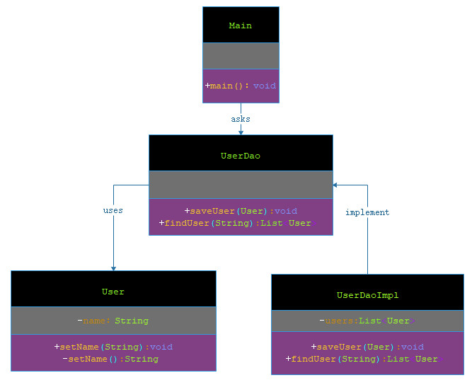

# 数据访问对象模式

***

###### 数据访问对象模式（Data Access Object Pattern）或 DAO 模式用于把低级的数据访问 API 或操作从高级的业务服务中分离出来。以下是数据访问对象模式的参与者。

- 数据访问对象接口（Data Access Object Interface）：该接口定义了在一个模型对象上要执行的标准操作。

- 数据访问对象实体类（Data Access Object concrete class）：该类实现了上述的接口。该类负责从数据源获取数据，数据源可以是数据库，也可以是 xml，或者是其他的存储机制。

- 模型对象/数值对象（Model Object/Value Object）：该对象是简单的 POJO，包含了 get/set 方法来存储通过使用 DAO 类检索到的数据。

***

## 实现

###### 我们将创建一个作为模型对象或数值对象的 Student 对象。StudentDao 是数据访问对象接口。StudentDaoImpl 是实现了数据访问对象接口的实体类。DaoPatternDemo，我们的演示类使用 StudentDao 来演示数据访问对象模式的用法。




> 步骤 1：创建数值对象。

**User.java**

```markdown

    package com.dao.pattern.dataaccessobject.vo;
    
    /**
     * 用户
     *
     * @author 阿导
     * @version 1.0
     * @fileName com.dao.pattern.dataaccessobject.vo.User.java
     * @CopyRright (c) 2018-万物皆导
     * @created 2018-04-04 16:23:00
     */
    public class User {
        /**
         * 名称
         */
        private String name;
    
        public User(String name) {
            this.name = name;
        }
    
        public String getName() {
            return name;
        }
    
        public void setName(String name) {
            this.name = name;
        }
    
    }

```

> 步骤 2：创建数据访问对象接口。

**UserDao.java**

```markdown

    package com.dao.pattern.dataaccessobject.dao;
    
    import com.dao.pattern.dataaccessobject.vo.User;
    
    import java.util.List;
    
    /**
     * 用户数据访问层
     *
     * @author 阿导
     * @version 1.0
     * @fileName com.dao.pattern.dataaccessobject.dao.UserDao.java
     * @CopyRright (c) 2018-万物皆导
     * @created 2018-04-04 16:27:00
     */
    public interface UserDao {
    
        void saveUser(User user);
    
        /**
         * 查询用户信息
         *
         * @author 阿导
         * @time 2018/4/4
         * @CopyRight 万物皆导
         * @param
         * @return com.dao.pattern.dataaccessobject.vo.User
         */
        List<User> findUser(String name);
    }

```

> 步骤 3：创建实现了上述接口的实体类。

**UserDaoImpl.java**

```markdown

    package com.dao.pattern.dataaccessobject.dao;
    
    import com.dao.pattern.dataaccessobject.vo.User;
    
    import java.util.ArrayList;
    import java.util.List;
    
    /**
     * 数据访问层实现
     *
     * @author 阿导
     * @version 1.0
     * @fileName com.dao.pattern.dataaccessobject.dao.UserDaoImpl.java
     * @CopyRright (c) 2018-万物皆导
     * @created 2018-04-04 16:42:00
     */
    public class UserDaoImpl  implements UserDao {
    
        private List<User> users;
    
        {
            users=new ArrayList<>();
        }
    
        /**
         * 保存用户信息
         *
         * @author 阿导
         * @time 2018/4/4
         * @CopyRight 万物皆导
         * @param user
         * @return void
         */
        @Override
        public void saveUser(User user) {
            users.add(user);
        }
    
        /**
         * 查询用户信息
         *
         * @param name
         * @return com.dao.pattern.dataaccessobject.vo.User
         * @author 阿导
         * @time 2018/4/4
         * @CopyRight 万物皆导
         */
        @Override
        public List<User> findUser(String name) {
            List<User> rs=new ArrayList<>();
            users.stream().filter(user -> user.getName().contains(name)).forEach(user -> rs.add(user));
            return rs;
        }
    
    
    }

```

> 步骤 4：使用 UserDao 来演示数据访问对象模式的用法。

**Main.java**

```markdown
    
    package com.dao.pattern.dataaccessobject.main;
    
    import com.alibaba.fastjson.JSON;
    import com.dao.pattern.dataaccessobject.dao.UserDao;
    import com.dao.pattern.dataaccessobject.dao.UserDaoImpl;
    import com.dao.pattern.dataaccessobject.vo.User;
    
    import java.util.List;
    
    /**
     * 郑旭入口
     *
     * @author 阿导
     * @version 1.0
     * @fileName com.dao.pattern.dataaccessobject.main.Main.java
     * @CopyRright (c) 2018-万物皆导
     * @created 2018-04-04 17:24:00
     */
    public class Main {
    
        /**
         * 主方法入口
         *
         * @author 阿导
         * @time 2018/4/4
         * @CopyRight 万物皆导
         * @param args
         * @return void
         */
        public static void main(String[] args){
            //初始化 Dao 层
            UserDao userDao=new UserDaoImpl();
    
            //添加用户
            userDao.saveUser(new User("小明"));
            userDao.saveUser(new User("大明"));
            userDao.saveUser(new User("孙明"));
            userDao.saveUser(new User("小花"));
            userDao.saveUser(new User("小芳"));
    
            //查询用户
            List<User> users = userDao.findUser("小");
    
            //打印用户
            System.out.println(JSON.toJSONString(users));
        }
    
    }

```

> 步骤 5：验证输出。

```markdown
    
    [
      {"name":"小明"},
      {"name":"小花"},
      {"name":"小芳"}
    ]
    
```
