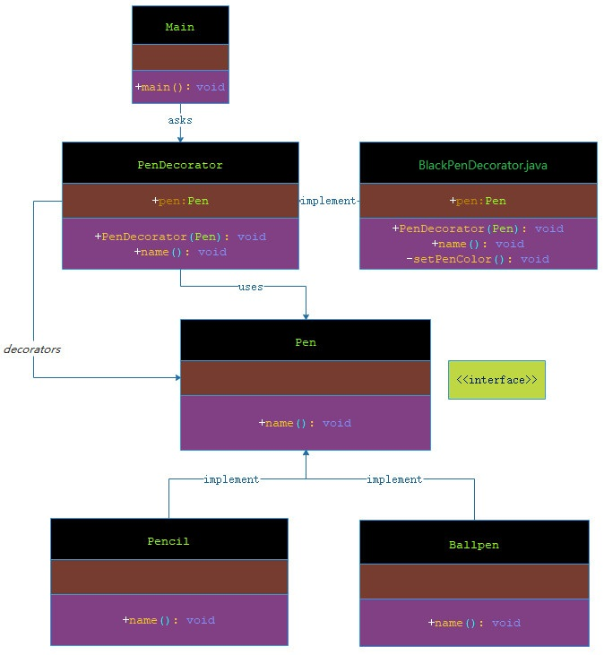

# 装饰器模式

***

###### 装饰器模式（Decorator Pattern）允许向一个现有的对象添加新的功能，同时又不改变其结构。这种类型的设计模式属于结构型模式，它是作为现有的类的一个包装。

###### 这种模式创建了一个装饰类，用来包装原有的类，并在保持类方法签名完整性的前提下，提供了额外的功能。

###### 我通过下面的实例来演示装饰器模式的用法。其中，我将把一支笔装饰上不同的颜色，同时又不改变笔的种类。

***

## 介绍

- **意图**：动态地给一个对象添加一些额外的职责。就增加功能来说，装饰器模式相比生成子类更为灵活。

- **主要解决**：一般的，我们为了扩展一个类经常使用继承方式实现，由于继承为类引入静态特征，并且随着扩展功能的增多，子类会很膨胀。

- **何时使用**：在不想增加很多子类的情况下扩展类。

- **如何解决**：将具体功能职责划分，同时继承装饰者模式。

- **关键代码**：

> 1、Component 类充当抽象角色，不应该具体实现。 

> 2、修饰类引用和继承 Component 类，具体扩展类重写父类方法。

- **应用实例**：

> 1、孙悟空有 72 变，当他变成"庙宇"后，他的根本还是一只猴子，但是他又有了庙宇的功能。 

> 2、不论一幅画有没有画框都可以挂在墙上，但是通常都是有画框的，并且实际上是画框被挂在墙上。在挂在墙上之前，画可以被蒙上玻璃，装到框子里；这时画、玻璃和画框形成了一个物体。

- **优点**：装饰类和被装饰类可以独立发展，不会相互耦合，装饰模式是继承的一个替代模式，装饰模式可以动态扩展一个实现类的功能。

- **缺点**：多层装饰比较复杂。

- **使用场景**：

> 1、扩展一个类的功能。 

> 2、动态增加功能，动态撤销。

- **注意事项**：可代替继承。

***

## 实现

###### 我将创建一个 Pen 接口和实现了 Pen 接口的实体类。然后我创建一个实现了 Pen 接口的抽象装饰类 PenDecorator，并把 Pen 对象作为它的实例变量。

###### BlackPenDecorator 是实现了 PenDecorator 的实体类。

###### Main，我的演示类使用 PenDecorator 来装饰 Pen 对象。




> 步骤 1：创建一个接口。

**Pen.java**
 
```markdown

    package com.dao.pattern.decorator.interfaces;
    
    /**
     * 笔
     *
     * @author 阿导
     * @version 1.0
     * @fileName com.dao.pattern.decorator.interfaces.Pen.java
     * @CopyRright (c) 2018-万物皆导
     * @created 2018-03-24 16:45:00
     */
    public interface Pen {
    
        /**
         * 获取笔的名称
         *
         * @author 阿导
         * @time 2018/3/24
         * @CopyRight 万物皆导
         * @param
         * @return void
         */
        void name();
    }

```
> 步骤 2：创建实现接口的实体类。

**Pencil.java**

```markdown
        
    package com.dao.pattern.decorator.impl;
    
    import com.dao.pattern.decorator.interfaces.Pen;
    
    /**
     * 铅笔
     *
     * @author 阿导
     * @version 1.0
     * @fileName com.dao.pattern.decorator.impl.Pencil.java
     * @CopyRright (c) 2018-万物皆导
     * @created 2018-03-24 16:46:00
     */
    public class Pencil implements Pen {
    
        /**
         * 获取铅笔的名称
         *
         * @return void
         * @author 阿导
         * @time 2018/3/24
         * @CopyRight 万物皆导
         */
        @Override
        public void name() {
            System.out.println("我是铅笔。");
        }
    }

```

**Ballpen.java**

```markdown

    package com.dao.pattern.decorator.impl;
    
    import com.dao.pattern.decorator.interfaces.Pen;
    
    /**
     * 圆珠笔
     *
     * @author 阿导
     * @version 1.0
     * @fileName com.dao.pattern.decorator.impl.Ballpen.java
     * @CopyRright (c) 2018-万物皆导
     * @created 2018-03-24 16:47:00
     */
    public class Ballpen implements Pen {
    
        /**
         * 获取圆珠笔的名称
         *
         * @return void
         * @author 阿导
         * @time 2018/3/24
         * @CopyRight 万物皆导
         */
        @Override
        public void name() {
            System.out.println("我是圆珠笔。");
        }
    }

```

> 步骤 3：创建实现了 PenDecorator 接口的抽象装饰类。

**PenDecorator.java**
  
```markdown

    package com.dao.pattern.decorator.core;
    
    import com.dao.pattern.decorator.interfaces.Pen;
    
    /**
     * 笔的装饰器
     *
     * @author 阿导
     * @version 1.0
     * @fileName com.dao.pattern.decorator.core.PenDecorator.java
     * @CopyRright (c) 2018-万物皆导
     * @created 2018-03-24 16:48:00
     */
    public class PenDecorator implements Pen {
    
        /**
         * 笔
         */
        protected Pen pen;
        /**
         * 笔的装饰器构造方法
         *
         * @author 阿导
         * @time 2018/3/24
         * @CopyRight 万物皆导
         * @param pen
         * @return
         */
        public PenDecorator(Pen pen) {
            this.pen = pen;
        }
    
        /**
         * 获取笔的名称
         *
         * @return void
         * @author 阿导
         * @time 2018/3/24
         * @CopyRight 万物皆导
         */
        @Override
        public void name() {
            pen.name();
        }
    }

```

> 步骤 4：创建扩展了 PenDecorator 类的实体装饰类。

**BlackPenDecorator.java**

```markdown

    package com.dao.pattern.decorator.core;
    
    import com.dao.pattern.decorator.interfaces.Pen;
    
    /**
     * 黑色的笔
     *
     * @author 阿导
     * @version 1.0
     * @fileName com.dao.pattern.decorator.core.BlackPenDecorator.java
     * @CopyRright (c) 2018-万物皆导
     * @created 2018-03-24 16:50:00
     */
    public class BlackPenDecorator extends PenDecorator {
    
        public BlackPenDecorator(Pen pen) {
            super(pen);
        }
        /**
         * 获取笔的名称以及其他属性
         *
         * @return void
         * @author 阿导
         * @time 2018/3/24
         * @CopyRight 万物皆导
         */
        @Override
        public void name(){
            pen.name();
            setPenColor();
        }
    
        /**
         * 笔的颜色
         *
         * @author 阿导
         * @time 2018/3/24
         * @CopyRight 万物皆导
         * @param
         * @return void
         */
        private void setPenColor() {
            System.out.println("我是黑色的笔。");
        }
    }

```

> 步骤 5：使用 BlackPenDecorator 来装饰 Pen 对象。

**Main.java**

```markdown
    
    package com.dao.pattern.decorator.main;
    
    import com.dao.pattern.decorator.core.BlackPenDecorator;
    import com.dao.pattern.decorator.impl.Ballpen;
    import com.dao.pattern.decorator.impl.Pencil;
    import com.dao.pattern.decorator.interfaces.Pen;
    
    /**
     * 主程序入口
     *
     * @author 阿导
     * @version 1.0
     * @fileName com.dao.pattern.decorator.main.Main.java
     * @CopyRright (c) 2018-万物皆导
     * @created 2018-03-24 16:53:00
     */
    public class Main {
    
        /**
         * 主方法入口
         *
         * @author 阿导
         * @time 2018/3/24
         * @CopyRight 万物皆导
         * @param args
         * @return void
         */
        public static void main(String[] args){
            //铅笔
            Pen pencil=new Pencil();
            System.out.println("=======铅笔=========");
            pencil.name();
    
            //圆珠笔
            Pen ballPen=new Ballpen();
            System.out.println("=======圆珠笔=========");
            ballPen.name();
    
            //黑色的铅笔
            Pen blackPencil=new BlackPenDecorator(pencil);
            System.out.println("=======黑色的铅笔=========");
            blackPencil.name();
    
            //黑色的圆珠笔
            Pen blackBallPen=new BlackPenDecorator(ballPen);
            System.out.println("=======黑色的圆珠笔=========");
            blackBallPen.name();
    
        }
    
    }

```

> 步骤 6：验证输出。

```markdown

    =======铅笔=========
    我是铅笔。
    =======圆珠笔=========
    我是圆珠笔。
    =======黑色的铅笔=========
    我是铅笔。
    我是黑色的笔。
    =======黑色的圆珠笔=========
    我是圆珠笔。
    我是黑色的笔。
    
```
