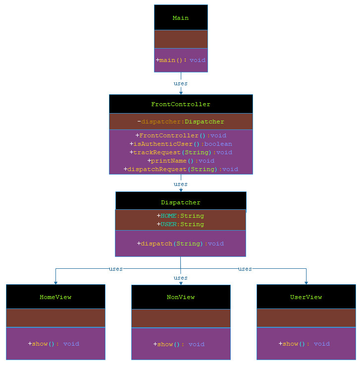

# 前端控制器模式

*** 

###### 前端控制器模式（Front Controller Pattern）是用来提供一个集中的请求处理机制，所有的请求都将由一个单一的处理程序处理。该处理程序可以做认证/授权/记录日志，或者跟踪请求，然后把请求传给相应的处理程序。以下是这种设计模式的实体。

- 前端控制器（Front Controller）：处理应用程序所有类型请求的单个处理程序，应用程序可以是基于 web 的应用程序，也可以是基于桌面的应用程序。

- 调度器（Dispatcher）：前端控制器可能使用一个调度器对象来调度请求到相应的具体处理程序。

- 视图（View）：视图是为请求而创建的对象。

***

## 实现

###### 我将创建 FrontController、Dispatcher 分别当作前端控制器和调度器。HomeView 和 StudentView 表示各种为前端控制器接收到的请求而创建的视图。

###### Main，我们的演示类使用 FrontController 来演示前端控制器设计模式。




> 步骤 1：创建视图。

**HomeView.java**

```markdown
    
    package com.dao.pattern.frontcontroller.vo;
    
    /**t
     * 视图：首页
     *
     * @author 阿导
     * @version 1.0
     * @fileName com.dao.pattern.frontcontroller.vo.HomeView.java
     * @CopyRright (c) 2018-万物皆导
     * @created 2018-04-07 12:40:00
     */
    public class HomeView{
    
        /**
         * 首页视图
         *
         * @author 阿导
         * @time 2018/4/7
         * @CopyRight 万物皆导
         * @param
         * @return void
         */
        public void show(){
            System.out.println("进入主页");
        }
    }

```


**UserView.java**

```markdown

    package com.dao.pattern.frontcontroller.vo;
    
    /**
     * 视图：用户中心
     *
     * @author 阿导
     * @version 1.0
     * @fileName com.dao.pattern.frontcontroller.vo.UserView.java
     * @CopyRright (c) 2018-万物皆导
     * @created 2018-04-07 12:41:00
     */
    public class UserView{
        /**
         * 用户中心视图
         *
         * @author 阿导
         * @time 2018/4/7
         * @CopyRight 万物皆导
         * @param
         * @return void
         */
        public void show(){
            System.out.println("进入用户中心");
        }
    }

```


**NonView.java**

```markdown
    
    package com.dao.pattern.frontcontroller.vo;
    
    /**
     * 无效的页面
     *
     * @author 阿导
     * @version 1.0
     * @fileName com.dao.pattern.frontcontroller.vo.NonView.java
     * @CopyRright (c) 2018-万物皆导
     * @created 2018-04-07 12:50:00
     */
    public class NonView {
        /**
         * 无效页面
         *
         * @author 阿导
         * @time 2018/4/7
         * @CopyRight 万物皆导
         * @param
         * @return void
         */
        public void show(){
            System.out.println("无效页面");
        }
    }

```


> 步骤 2：创建调度器 Dispatcher。

**Dispatcher.java**

```markdown
    
    package com.dao.pattern.frontcontroller.core;
    
    import com.dao.pattern.frontcontroller.vo.HomeView;
    import com.dao.pattern.frontcontroller.vo.NonView;
    import com.dao.pattern.frontcontroller.vo.UserView;
    
    /**
     * 调度器
     *
     * @author 阿导
     * @version 1.0
     * @fileName com.dao.pattern.frontcontroller.core.Dispatcher.java
     * @CopyRright (c) 2018-万物皆导
     * @created 2018-04-07 12:42:00
     */
    public class Dispatcher{
        /**
         * 首页
         */
        public static final String HOME="HOME";
        /**
         * 用户
         */
        public static final String USER="USER";
    
        /**
         * 通过请求的视图关键字来进行调度对应的视图
         *
         * @author 阿导
         * @time 2018/4/7
         * @CopyRight 万物皆导
         * @param requst
         * @return void
         */
        public void dispatch(String requst){
            if(HOME.equalsIgnoreCase(requst)){
                new HomeView().show();
            }else if(USER.equalsIgnoreCase(requst)){
                new UserView().show();
            }else {
                new NonView().show();
            }
        }
    
    }

```

> 步骤 3：创建前端控制器 FrontController。

**FrontController.java**

```markdown
    
    package com.dao.pattern.frontcontroller.core;
    
    /**
     * 前端控制器
     *
     * @author 阿导
     * @version 1.0
     * @fileName com.dao.pattern.frontcontroller.core.FrontController.java
     * @CopyRright (c) 2018-万物皆导
     * @created 2018-04-07 12:43:00
     */
    public class FrontController {
        /**
         * 声明调度器
         */
        private Dispatcher dispatcher;
    
        /**
         * 构造方法对成员变量进行初始化
         *
         * @author 阿导
         * @time 2018/4/7
         * @CopyRight 万物皆导
         * @param
         * @return
         */
        public FrontController(){
            dispatcher = new Dispatcher();
        }
    
        /**
         * 模拟用户校验
         *
         * @author 阿导
         * @time 2018/4/7
         * @CopyRight 万物皆导
         * @param
         * @return boolean
         */
        private boolean isAuthenticUser(){
            System.out.println("这里一般可以做一些权限校验。");
            return true;
        }
    
        /**
         * 记录请求记录
         *
         * @author 阿导
         * @time 2018/4/7
         * @CopyRight 万物皆导
         * @param request
         * @return void
         */
        private void trackRequest(String request){
            System.out.println("用户请求记录：" + request);
        }
    
        /**
         * 调度器调度视图
         *
         * @author 阿导
         * @time 2018/4/7
         * @CopyRight 万物皆导
         * @param request
         * @return void
         */
        public void dispatchRequest(String request){
            //记录每一个请求
            trackRequest(request);
            //对用户进行身份验证
            if(isAuthenticUser()){
                dispatcher.dispatch(request);
            }
        }
    }

```

> 步骤 4：使用 FrontController 来演示前端控制器设计模式。

**Main.java**

```markdown
    
    package com.dao.pattern.frontcontroller.main;
    
    import com.dao.pattern.frontcontroller.core.Dispatcher;
    import com.dao.pattern.frontcontroller.core.FrontController;
    
    /**
     * 主程序入口
     *
     * @author 阿导
     * @version 1.0
     * @fileName com.dao.pattern.frontcontroller.main.Main.java
     * @CopyRright (c) 2018-万物皆导
     * @created 2018-04-07 12:59:00
     */
    public class Main {
    
        /**
         * 主方法入口
         *
         * @author 阿导
         * @time 2018/4/7
         * @CopyRight 万物皆导
         * @param args
         * @return void
         */
        public static void main(String[] args){
            //声明前端控制器
            FrontController controller=new FrontController();
            //进入首页
            controller.dispatchRequest(Dispatcher.HOME);
            System.out.println("=================================");
            //进入用户中心
            controller.dispatchRequest(Dispatcher.HOME);
            System.out.println("=================================");
            //进入其他页面
            controller.dispatchRequest("OTHER");
        }
    
    }

```

> 步骤 5：验证输出。

```markdown
    
    用户请求记录：HOME
    这里一般可以做一些权限校验。
    进入主页
    =================================
    用户请求记录：HOME
    这里一般可以做一些权限校验。
    进入主页
    =================================
    用户请求记录：OTHER
    这里一般可以做一些权限校验。
    无效页面
    
```
