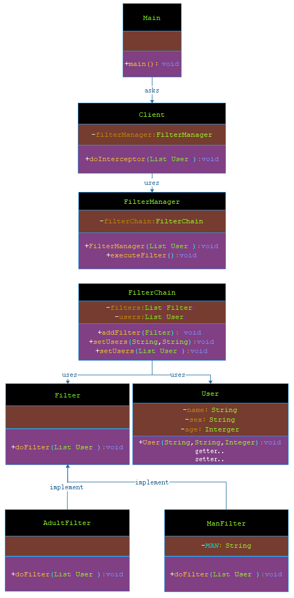

# 拦截过滤器模式

***

###### 拦截过滤器模式（Intercepting Filter Pattern）用于对应用程序的请求或响应做一些预处理/后处理。定义过滤器，并在把请求传给实际目标应用程序之前应用在请求上。过滤器可以做认证/授权/记录日志，或者跟踪请求，然后把请求传给相应的处理程序。以下是这种设计模式的实体。

- 过滤器（Filter）：过滤器在请求处理程序执行请求之前或之后，执行某些任务。

- 过滤器链（Filter Chain）：过滤器链带有多个过滤器，并在 Target 上按照定义的顺序执行这些过滤器。

- 处理的对象（Target)：Target 对象是请求处理程序。

- 过滤管理器（Filter Manager）：过滤管理器管理过滤器和过滤器链。

- 客户端（Client）：Client 是向 Target 对象发送请求的对象。

***

## 实现

###### 我将创建 FilterChain、FilterManager、User、Client 作为表示实体的各种对象。AdultFilter 和 ManFilter 表示实体过滤器。

###### Main，我的演示类使用 Client 来演示拦截过滤器设计模式。



> 步骤 1：创建过滤器接口 Filter。

**Filter.java**

```markdown

    package com.dao.pattern.interceptingfilter.interfaces;
    
    import com.dao.pattern.interceptingfilter.vo.User;
    
    import java.util.List;
    
    /**
     * 过滤器接口
     *
     * @author 阿导
     * @version 1.0
     * @fileName com.dao.pattern.interceptingfilter.interfaces.Filter.java
     * @CopyRright (c) 2018-万物皆导
     * @created 2018-04-07 14:25:00
     */
    public interface Filter {
    
        /**
         * 执行过滤规则
         *
         * @author 阿导
         * @time 2018/4/7
         * @CopyRight 万物皆导
         * @param users
         * @return void
         */
        void doFilter(List<User> users);
    }

```

> 步骤 2：创建实体过滤器。

**AdultFilter.java**

```markdown

    package com.dao.pattern.interceptingfilter.impl;
    
    import com.dao.pattern.interceptingfilter.interfaces.Filter;
    import com.dao.pattern.interceptingfilter.vo.User;
    
    import java.util.Iterator;
    import java.util.List;
    
    /**
     * 成人过滤
     *
     * @author 阿导
     * @version 1.0
     * @fileName com.dao.pattern.interceptingfilter.impl.AdultFilter.java
     * @CopyRright (c) 2018-万物皆导
     * @created 2018-04-07 14:31:00
     */
    public class AdultFilter implements Filter{
    
    
        /**
         * 执行过滤规则：去掉未成年人
         *
         * @param users
         * @return void
         * @author 阿导
         * @time 2018/4/7
         * @CopyRight 万物皆导
         */
        @Override
        public void doFilter(List<User> users) {
            Iterator<User> iterator=users.iterator();
            while (iterator.hasNext()){
                User user=iterator.next();
                if(user.getAge()<18){
                    iterator.remove();
                }
            }
        }
    }

```

**ManFilter.java**

```markdown

    package com.dao.pattern.interceptingfilter.impl;
    
    import com.dao.pattern.interceptingfilter.interfaces.Filter;
    import com.dao.pattern.interceptingfilter.vo.User;
    
    import java.util.Iterator;
    import java.util.List;
    
    /**
     * 过滤规则：男
     *
     * @author 阿导
     * @version 1.0
     * @fileName com.dao.pattern.interceptingfilter.impl.ManFilter.java
     * @CopyRright (c) 2018-万物皆导
     * @created 2018-04-07 14:34:00
     */
    public class ManFilter implements Filter {
    
        private static final String MAN="男";
    
        /**
         * 执行过滤规则：去掉女
         *
         * @param users
         * @return void
         * @author 阿导
         * @time 2018/4/7
         * @CopyRight 万物皆导
         */
        @Override
        public void doFilter(List<User> users) {
            Iterator<User> iterator=users.iterator();
            while (iterator.hasNext()){
                User user=iterator.next();
                if(!MAN.equalsIgnoreCase(user.getSex())){
                    iterator.remove();
                }
            }
        }
    }

```

> 步骤 3：创建 被处理的对象 User。

```markdown

    package com.dao.pattern.interceptingfilter.vo;
    
    /**
     * 用户，作为过滤的实体，也就是处理的对象：target
     *
     * @author 阿导
     * @version 1.0
     * @fileName com.dao.pattern.interceptingfilter.vo.User.java
     * @CopyRright (c) 2018-万物皆导
     * @created 2018-04-07 14:27:00
     */
    public class User {
        /**
         * 姓名
         */
        private String name;
        /**
         * 性别
         */
        private String sex;
        /**
         * 年龄
         */
        private Integer age;
    
        public User(String name, String sex, Integer age) {
            this.name = name;
            this.sex = sex;
            this.age = age;
        }
    
        public String getName() {
            return name;
        }
    
        public void setName(String name) {
            this.name = name;
        }
    
        public String getSex() {
            return sex;
        }
    
        public void setSex(String sex) {
            this.sex = sex;
        }
    
        public Integer getAge() {
            return age;
        }
    
        public void setAge(Integer age) {
            this.age = age;
        }
    }

```

> 步骤 4：创建过滤器链。

**FilterChain.java**

```markdown
    
    package com.dao.pattern.interceptingfilter.core;
    
    import com.dao.pattern.interceptingfilter.interfaces.Filter;
    import com.dao.pattern.interceptingfilter.vo.User;
    
    import java.util.ArrayList;
    import java.util.List;
    
    /**
     * 过滤器执行链
     *
     * @author 阿导
     * @version 1.0
     * @fileName com.dao.pattern.interceptingfilter.core.FilterChain.java
     * @CopyRright (c) 2018-万物皆导
     * @created 2018-04-07 14:37:00
     */
    public class FilterChain {
        /**
         * 声明过滤器集合
         */
        private List<Filter> filters;
        /**
         * 声明被处理的对象集合
         */
        private List<User> users;
    
        /**
         * 构造块给属性分配空间
         */
        {
            this.filters=new ArrayList<>();
            this.users=new ArrayList<>();
        }
    
        /**
         * 添加过滤规则
         *
         * @author 阿导
         * @time 2018/4/7
         * @CopyRight 万物皆导
         * @param filter
         * @return void
         */
        public void addFilter(Filter filter){
            this.filters.add(filter);
        }
    
    
        public void doFilter(){
            if(this.filters!=null&&!this.filters.isEmpty()&&this.users!=null&&!this.users.isEmpty()) {
                this.filters.forEach(filter -> filter.doFilter(this.users));
            }
        }
    
        public void setUsers(List<User> users){
            this.users=users;
        }
    }

```

> 步骤 5：创建过滤管理器。

**FilterManager.java**

```markdown
    
    package com.dao.pattern.interceptingfilter.core;
    
    import com.dao.pattern.interceptingfilter.impl.AdultFilter;
    import com.dao.pattern.interceptingfilter.impl.ManFilter;
    import com.dao.pattern.interceptingfilter.vo.User;
    
    import java.util.List;
    
    /**
     * 过滤器管理器
     *
     * @author 阿导
     * @version 1.0
     * @fileName com.dao.pattern.interceptingfilter.core.FilterManager.java
     * @CopyRright (c) 2018-万物皆导
     * @created 2018-04-07 14:47:00
     */
    public class FilterManager {
        /**
         * 声明过滤器执行链
         */
        private FilterChain filterChain;
    
        /**
         * 将过滤器添加到链路中，当然这里可以用一个方法替代更加灵活，此处就默认写死
         *
         * @author 阿导
         * @time 2018/4/7
         * @CopyRight 万物皆导
         * @param users
         * @return
         */
        public FilterManager(List<User> users) {
            //分配空间
            this.filterChain = new FilterChain();
            //添加成人规则
            this.filterChain.addFilter(new AdultFilter());
            //添加男人规则
            this.filterChain.addFilter(new ManFilter());
            //被处理的对象
            this.filterChain.setUsers(users);
        }
    
        /**
         * 执行过滤规则
         *
         * @author 阿导
         * @time 2018/4/7
         * @CopyRight 万物皆导
         * @param
         * @return void
         */
        public void executeFilter(){
            this.filterChain.doFilter();
        }
    
    }

```

> 步骤 6：创建客户端 Client。

**Client.java**

```markdown

    package com.dao.pattern.interceptingfilter.core;
    
    import com.dao.pattern.interceptingfilter.vo.User;
    
    import java.util.List;
    
    /**
     * 客户端
     *
     * @author 阿导
     * @version 1.0
     * @fileName com.dao.pattern.interceptingfilter.core.Client.java
     * @CopyRright (c) 2018-万物皆导
     * @created 2018-04-07 14:54:00
     */
    public class Client {
        /**
         * 声明过滤器管理器
         */
        private FilterManager filterManager;
        /**
         * 执行过滤规则
         *
         * @author 阿导
         * @time 2018/4/7
         * @CopyRight 万物皆导
         * @param users
         * @return void
         */
        public void doInterceptor(List<User> users){
            filterManager=new FilterManager(users);
            filterManager.executeFilter();
        }
    }

```

> 步骤 7：使用 Client 来演示拦截过滤器设计模式。

**Main.java**

```markdown
    
    package com.dao.pattern.interceptingfilter.main;
    
    import com.alibaba.fastjson.JSON;
    import com.dao.pattern.interceptingfilter.core.Client;
    import com.dao.pattern.interceptingfilter.vo.User;
    
    import java.util.ArrayList;
    import java.util.List;
    
    /**
     * 主程序入口
     *
     * @author 阿导
     * @version 1.0
     * @fileName com.dao.pattern.interceptingfilter.main.Main.java
     * @CopyRright (c) 2018-万物皆导
     * @created 2018-04-07 14:58:00
     */
    public class Main {
    
        /**
         * 主程序入口
         *
         * @author 阿导
         * @time 2018/4/7
         * @CopyRight 万物皆导
         * @param args
         * @return void
         */
        public static void main(String[] args){
            //声明过滤的对象
            List<User> users=new ArrayList<>();
            users.add(new User("小明","男",19));
            users.add(new User("小刚","男",17));
            users.add(new User("小林","女",16));
            users.add(new User("小许","女",20));
            users.add(new User("小亮","男",22));
            //打印过滤前的用户用于对比
            System.out.println("过滤前："+ JSON.toJSONString(users));
            //进行过滤
            Client client = new Client();
            client.doInterceptor(users);
            //打印过滤后的用户
            System.out.println("过滤后："+ JSON.toJSONString(users));
        }
    }

```

> 步骤 8：验证输出。

```markdown

    过滤前：
    [
      {"age":19,"name":"小明","sex":"男"},
      {"age":17,"name":"小刚","sex":"男"},
      {"age":16,"name":"小林","sex":"女"},
      {"age":20,"name":"小许","sex":"女"},
      {"age":22,"name":"小亮","sex":"男"}
    ]
    过滤后：
    [
      {"age":19,"name":"小明","sex":"男"},
      {"age":22,"name":"小亮","sex":"男"}
    ]
            
```
