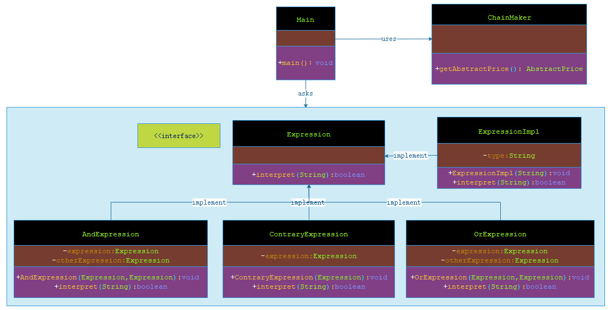

# 解释器模式

***

###### 解释器模式（Interpreter Pattern）提供了评估语言的语法或表达式的方式，它属于行为型模式。这种模式实现了一个表达式接口，该接口解释一个特定的上下文。这种模式被用在 SQL 解析、符号处理引擎等。

******

## 介绍


- **意图**：给定一个语言，定义它的文法表示，并定义一个解释器，这个解释器使用该标识来解释语言中的句子。

- **主要解决**：对于一些固定文法构建一个解释句子的解释器。

- **何时使用**：如果一种特定类型的问题发生的频率足够高，那么可能就值得将该问题的各个实例表述为一个简单语言中的句子。这样就可以构建一个解释器，该解释器通过解释这些句子来解决该问题。

- **如何解决**：构件语法树，定义终结符与非终结符。

- **关键代码**：构件环境类，包含解释器之外的一些全局信息，一般是 HashMap。

- **应用实例**：编译器、运算表达式计算。

- **优点**：

> 1、可扩展性比较好，灵活。 

> 2、增加了新的解释表达式的方式。 

> 3、易于实现简单文法。

- **缺点**： 

> 1、可利用场景比较少。 

> 2、对于复杂的文法比较难维护。
 
> 3、解释器模式会引起类膨胀。 

> 4、解释器模式采用递归调用方法。

- **使用场景**：
 
> 1、可以将一个需要解释执行的语言中的句子表示为一个抽象语法树。 

> 2、一些重复出现的问题可以用一种简单的语言来进行表达。 

> 3、一个简单语法需要解释的场景。

- **注意事项**：可利用场景比较少，JAVA 中如果碰到可以用 expression4J 代替。

***

## 实现

###### 我将创建一个接口 Expression 和实现了 Expression 接口的实体类。定义作为上下文中主要解释器的 ExpressionImpl 类。其他的类 OrExpression、AndExpression 、ContraryExpression 用于创建逻辑运算表达式。

###### Main，我的演示类使用 Expression 类创建规则和演示表达式的解析。




> 步骤 1：创建一个表达式接口。

**Expression.java**

```markdown

    package com.dao.pattern.interpreter.interfaces;
    
    /**
     * 解释器接口
     *
     * @author 阿导
     * @version 1.0
     * @fileName com.dao.pattern.interpreter.interfaces.Expression.java
     * @CopyRright (c) 2018-万物皆导
     * @created 2018-03-28 17:07:00
     */
    public interface Expression {
        /**
         * 判断是否是人类
         *
         * @author 阿导
         * @time 2018/3/28
         * @CopyRight 万物皆导
         * @param msg
         * @return boolean
         */
        boolean interpret(String msg);
    }

```

> 步骤 2：创建实现了上述接口的实体类。

**ExpressionImpl.java**

```markdown
    
    package com.dao.pattern.interpreter.impl;
    
    import com.dao.pattern.interpreter.interfaces.Expression;
    
    /**
     * 人类的解释器
     *
     * @author 阿导
     * @version 1.0
     * @fileName com.dao.pattern.interpreter.impl.ExpressionImpl.java
     * @CopyRright (c) 2018-万物皆导
     * @created 2018-03-28 17:09:00
     */
    public class ExpressionImpl implements Expression {
    
        /**
         * 类型
         */
        private String type;
    
        /**
         * 构造方法
         *
         * @author 阿导
         * @time 2018/3/28
         * @CopyRight 万物皆导
         * @param type
         * @return
         */
        public ExpressionImpl(String type) {
            this.type = type;
        }
    
        /**
         * 判断是否是人类
         *
         * @param msg
         * @return boolean
         * @author 阿导
         * @time 2018/3/28
         * @CopyRight 万物皆导
         */
        @Override
        public boolean interpret(String msg) {
           //包含信息
            if(msg.contains(type)){
                return true;
            }
            return false;
        }
    }

```

> 步骤 3： 逻辑运算规则实现

**ContraryExpression.java**
    
```markdown
    
    package com.dao.pattern.interpreter.core;
    
    import com.dao.pattern.interpreter.interfaces.Expression;
    
    /**
     * 非关系
     *
     * @author 阿导
     * @version 1.0
     * @fileName com.dao.pattern.interpreter.core.ContraryExpression.java
     * @CopyRright (c) 2018-万物皆导
     * @created 2018-03-28 17:19:00
     */
    public class ContraryExpression implements Expression{
    
        /**
         * 解释器
         */
        private Expression expression;
    
        /**
         * 非关系解释器
         *
         * @author 阿导
         * @time 2018/3/28
         * @CopyRight 万物皆导
         * @param expression
         * @return
         */
        public ContraryExpression(Expression expression) {
            this.expression = expression;
        }
    
        /**
         * 判断是否不是人类
         *
         * @param msg
         * @return boolean
         * @author 阿导
         * @time 2018/3/28
         * @CopyRight 万物皆导
         */
        @Override
        public boolean interpret(String msg) {
            return !expression.interpret(msg);
        }
    }

```

**AndExpression.java**

```markdown
    
    package com.dao.pattern.interpreter.core;
    
    import com.dao.pattern.interpreter.interfaces.Expression;
    
    /**
     * 且关系
     *
     * @author 阿导
     * @version 1.0
     * @fileName com.dao.pattern.interpreter.core.AndExpression.java
     * @CopyRright (c) 2018-万物皆导
     * @created 2018-03-28 17:16:00
     */
    public class AndExpression implements Expression{
        /**
         * 第一个解释器
         */
        private Expression expression;
        /**
         * 第二个解释器
         */
        private Expression otherExpression;
    
        /**
         * 且关系的构造方法
         *
         * @author 阿导
         * @time 2018/3/28
         * @CopyRight 万物皆导
         * @param expression
         * @param otherExpression
         * @return
         */
        public AndExpression(Expression expression, Expression otherExpression) {
            this.expression = expression;
            this.otherExpression = otherExpression;
        }
    
        /**
         * 判断是否都是人类
         *
         * @param msg
         * @return boolean
         * @author 阿导
         * @time 2018/3/28
         * @CopyRight 万物皆导
         */
        @Override
        public boolean interpret(String msg) {
            return expression.interpret(msg)&&otherExpression.interpret(msg);
        }
    }
    
```
    
**OrExpression.java**

```markdown
    
    package com.dao.pattern.interpreter.core;
    
    import com.dao.pattern.interpreter.interfaces.Expression;
    
    /**
     * 或关系
     *
     * @author 阿导
     * @version 1.0
     * @fileName com.dao.pattern.interpreter.core.OrExpression.java
     * @CopyRright (c) 2018-万物皆导
     * @created 2018-03-28 17:19:00
     */
    public class OrExpression implements Expression{
    
        /**
         * 第一个解释器
         */
        private Expression expression;
        /**
         * 第二个解释器
         */
        private Expression otherExpression;
    
        /**
         * 或关系构造方法
         *
         * @author 阿导
         * @time 2018/3/28
         * @CopyRight 万物皆导
         * @param expression
         * @param otherExpression
         * @return
         */
        public OrExpression(Expression expression, Expression otherExpression) {
            this.expression = expression;
            this.otherExpression = otherExpression;
        }
    
        /**
         * 判断是否有一个是人类
         *
         * @param msg
         * @return boolean
         * @author 阿导
         * @time 2018/3/28
         * @CopyRight 万物皆导
         */
        @Override
        public boolean interpret(String msg) {
            return expression.interpret(msg)||otherExpression.interpret(msg);
        }
    }

```

> 步骤 4： ExpressionMaker 使用 Expression 类来创建规则，作为解释器生成器

**ExpressionMaker.java**

```markdown

    package com.dao.pattern.interpreter.core;
    
    import com.dao.pattern.interpreter.impl.ExpressionImpl;
    import com.dao.pattern.interpreter.interfaces.Expression;
    
    /**
     * 解释器生成器
     *
     * @author 阿导
     * @version 1.0
     * @fileName com.dao.pattern.interpreter.core.ExpressionMaker.java
     * @CopyRright (c) 2018-万物皆导
     * @created 2018-03-28 17:26:00
     */
    public class ExpressionMaker {
    
        /**
         * 获取人类
         *
         * @author 阿导
         * @time 2018/3/28
         * @CopyRight 万物皆导
         * @param
         * @return com.dao.pattern.interpreter.interfaces.Expression
         */
        public static Expression getHumanExpression(){
            Expression bob = new ExpressionImpl("鲍勃");
            Expression tom = new ExpressionImpl("汤姆");
            return new OrExpression(bob, tom);
        }
    
        /**
         * 不是人
         *
         * @author 阿导
         * @time 2018/3/28
         * @CopyRight 万物皆导
         * @param
         * @return com.dao.pattern.interpreter.interfaces.Expression
         */
        public static Expression getContraryHumanExpression(){
            Expression wangzai = new ExpressionImpl("旺仔");
            return new ContraryExpression(wangzai);
        }
    
        /**
         * 男的并且是人类
         *
         * @author 阿导
         * @time 2018/3/28
         * @CopyRight 万物皆导
         * @param
         * @return com.dao.pattern.interpreter.interfaces.Expression
         */
        public static Expression getManHumanExpression(){
            Expression bob = new ExpressionImpl("鲍勃");
            Expression tom = new ExpressionImpl("男");
            return new AndExpression(bob, tom);
        }
    
    }

```

> 步骤 5：Main 是演示类，从 ExpressionMaker 获取解释器，并解析它们。

**Main.java**

```markdown
    
    package com.dao.pattern.interpreter.main;
    
    import com.dao.pattern.interpreter.core.ExpressionMaker;
    import com.dao.pattern.interpreter.interfaces.Expression;
    
    /**
     * 主程序入口
     *
     * @author 阿导
     * @version 1.0
     * @fileName com.dao.pattern.interpreter.main.Main.java
     * @CopyRright (c) 2018-万物皆导
     * @created 2018-03-28 17:40:00
     */
    public class Main {
    
        /**
         * 主方法入口
         *
         * @author 阿导
         * @time 2018/3/28
         * @CopyRight 万物皆导
         * @param args
         * @return void
         */
        public static void main(String[] args){
            //人类
            Expression human= ExpressionMaker.getHumanExpression();
            //非人类
            Expression contraryHuman= ExpressionMaker.getContraryHumanExpression();
            //男人
            Expression man= ExpressionMaker.getManHumanExpression();
    
    
            System.out.println("汤姆是人类吗？答曰：".concat(human.interpret("汤姆")?"是":"否"));
            System.out.println("旺仔是人类吗？答曰：".concat(contraryHuman.interpret("旺仔")?"是":"否"));
            System.out.println("鲍勃是男人嘛？答曰：".concat(man.interpret("鲍勃 男")?"是":"否"));
        }
    }

```

> 步骤 6：验证输出。

```markdown
    
    汤姆是人类吗？答曰：是
    旺仔是人类吗？答曰：否
    鲍勃是男人嘛？答曰：是
    
```

