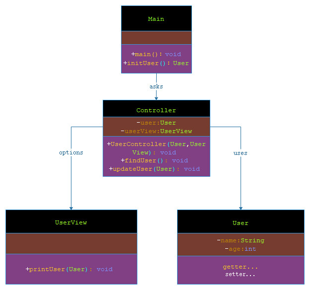

# MVC 模式

***

###### MVC 模式代表 Model-View-Controller（模型-视图-控制器） 模式。这种模式用于应用程序的分层开发。

###### Model（模型） - 模型代表一个存取数据的对象或 JAVA POJO。它也可以带有逻辑，在数据变化时更新控制器。

###### View（视图） - 视图代表模型包含的数据的可视化。

###### Controller（控制器） - 控制器作用于模型和视图上。它控制数据流向模型对象，并在数据变化时更新视图。它使视图与模型分离开。

***

## 实现

###### 我将创建一个作为模型的 User 对象。UserView 是一个把用户详细信息输出到控制台的视图类，UserController 是负责存储数据到 User 对象中的控制器类，并相应地更新视图 UserView。

###### Main，我的演示类使用 UserController 来演示 MVC 模式的用法。



> 步骤 1：创建模型。

**User.java**

```markdown

    package com.dao.pattern.mvc.model;
    
    /**
     * 用户模型
     *
     * @author 阿导
     * @version 1.0
     * @fileName com.dao.pattern.mvc.model.User.java
     * @CopyRright (c) 2018-万物皆导
     * @created 2018-04-03 09:54:00
     */
    public class User {
        /**
         * 姓名
         */
        private String name;
        /**
         * 年龄
         */
        private int age;
    
        public String getName() {
            return name;
        }
    
        public void setName(String name) {
            this.name = name;
        }
    
        public int getAge() {
            return age;
        }
    
        public void setAge(int age) {
            this.age = age;
        }
    }

```

> 步骤 2：创建视图。

**UserView.java**

```markdown
    
    package com.dao.pattern.mvc.view;
    
    import com.alibaba.fastjson.JSON;
    import com.dao.pattern.mvc.model.User;
    
    /**
     * 用户视图
     *
     * @author 阿导
     * @version 1.0
     * @fileName com.dao.pattern.mvc.view.UserView.java
     * @CopyRright (c) 2018-万物皆导
     * @created 2018-04-03 09:55:00
     */
    public class UserView {
        /**
         * 打印用户信息
         *
         * @author 阿导
         * @time 2018/4/3
         * @CopyRight 万物皆导
         * @param user
         * @return void
         */
        public void printUser(User user){
            System.out.println(JSON.toJSONString(user));
        }
    }

```

> 步骤 3：创建控制器。

**UserController.java**

```markdown
    
    package com.dao.pattern.mvc.controller;
    
    import com.dao.pattern.mvc.model.User;
    import com.dao.pattern.mvc.view.UserView;
    
    /**
     * 用户控制器
     *
     * @author 阿导
     * @version 1.0
     * @fileName com.dao.pattern.mvc.controller.UserController.java
     * @CopyRright (c) 2018-万物皆导
     * @created 2018-04-03 09:56:00
     */
    public class UserController {
        /**
         * 用户
         */
        private User user;
        /**
         * 用户视图
         */
        private UserView userView;
    
        /**
         * 构造方法
         *
         * @author 阿导
         * @time 2018/4/3
         * @CopyRight 万物皆导
         * @param user
         * @param userView
         * @return
         */
        public UserController(User user, UserView userView) {
            this.user = user;
            this.userView = userView;
        }
        /**
         * 查询用户
         *
         * @author 阿导
         * @time 2018/4/3
         * @CopyRight 万物皆导
         * @param
         * @return com.dao.pattern.mvc.model.User
         */
        public void findUser(){
            userView.printUser(user);
        }
    
        /**
         * 更新用户
         *
         * @author 阿导
         * @time 2018/4/3
         * @CopyRight 万物皆导
         * @param user
         * @return void
         */
        public void updateUser(User user){
             this.user=user;
        }
    
    }

```

> 步骤 4：Main，使用 UserController 方法来演示 MVC 设计模式的用法。

**Main.java**

```markdown

    package com.dao.pattern.mvc.main;
    
    import com.dao.pattern.mvc.controller.UserController;
    import com.dao.pattern.mvc.model.User;
    import com.dao.pattern.mvc.view.UserView;
    
    /**
     * 主程序入口
     *
     * @author 阿导
     * @version 1.0
     * @fileName com.dao.pattern.mvc.main.Main.java
     * @CopyRright (c) 2018-万物皆导
     * @created 2018-04-03 10:15:00
     */
    public class Main {
    
        /**
         * 主程序入口
         *
         * @author 阿导
         * @time 2018/4/3
         * @CopyRight 万物皆导
         * @param args
         * @return void
         */
        public static void main(String[] args){
            //初始化用户信息，声明模型
            User user=initUser();
            //声明视图
            UserView userView=new UserView();
            //声明控制器
            UserController userController=new UserController(user,userView);
            //查询用户信息
            System.out.print("初始化的用户信息：");
            userController.findUser();
            //创建更新用户模型
            User userUpdate=new User();
            //更新信息写入
            userUpdate.setName(user.getName());
            userUpdate.setAge(105);
            userController.updateUser(userUpdate);
            //再次打印用户信息
            System.out.print("更新的用户信息：");
            userController.findUser();
        }
    
        /**
         * 初始化用户信息
         *
         * @author 阿导
         * @time 2018/4/3
         * @CopyRight 万物皆导
         * @param
         * @return com.dao.pattern.mvc.model.User
         */
        private static User initUser(){
            User user=new User();
            user.setName("万物");
            user.setAge(10000);
            return user;
        }
    }

```

> 步骤 5：验证输出。

```markdown

    初始化的用户信息：
    {"age":10000,"name":"万物"}
    更新的用户信息：
    {"age":105,"name":"万物"}
    
```
