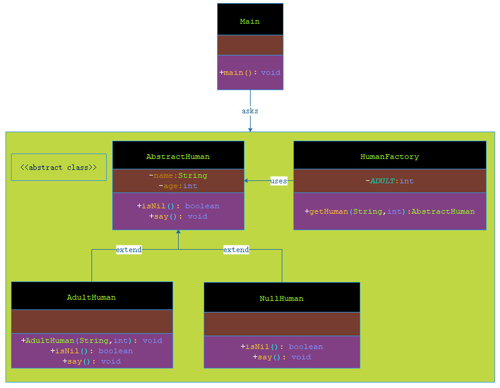

# 空对象模式

***

###### 在空对象模式（Null Object Pattern）中，一个空对象取代 NULL 对象实例的检查。Null 对象不是检查空值，而是反应一个不做任何动作的关系。这样的 Null 对象也可以在数据不可用的时候提供默认的行为。

###### 在空对象模式中，我们创建一个指定各种要执行的操作的抽象类和扩展该类的实体类，还创建一个未对该类做任何实现的空对象类，该空对象类将无缝地使用在需要检查空值的地方。

***

## 实现

###### 我们将创建一个定义操作（在这里，是能上网的人）的 AbstractHuman 抽象类，和扩展了 AbstractHuman 类的实体类。工厂类 HumanFactory 基于年龄来返回 AdultHuman 或 NullHuman 对象。

###### Main，我们的演示类使用 HumanFactory 来演示空对象模式的用法。




> 步骤 1：创建一个抽象类。

**AbstractHuman.java**

```markdown

    package com.dao.pattern.nullobject.core;
    
    /**
     * 抽象类：人
     *
     * @author 阿导
     * @version 1.0
     * @fileName com.dao.pattern.nullobject.core.AbstractHuman.java
     * @CopyRright (c) 2018-万物皆导
     * @created 2018-04-02 15:42:00
     */
    public abstract class AbstractHuman {
        /**
         * 姓名
         */
        protected String name;
        /**
         * 年龄
         */
        protected int age;
    
        /**
         * 判断是不是空
         *
         * @author 阿导
         * @time 2018/4/2
         * @CopyRight 万物皆导
         * @param
         * @return boolean
         */
        public abstract boolean isNil();
        /**
         * 说一些什么
         *
         * @author 阿导
         * @time 2018/4/2
         * @CopyRight 万物皆导
         * @param
         * @return void
         */
        public abstract void say();
    }

```

> 步骤 2：创建扩展了上述类的实体类。

**AdultHuman.java**

```markdown
    
    package com.dao.pattern.nullobject.core;
    
    /**
     * 成人
     *
     * @author 阿导
     * @version 1.0
     * @fileName com.dao.pattern.nullobject.core.AdultHuman.java
     * @CopyRright (c) 2018-万物皆导
     * @created 2018-04-02 15:51:00
     */
    public class AdultHuman extends AbstractHuman {
    
        /**
         * 构造方法
         *
         * @author 阿导
         * @time 2018/4/2
         * @CopyRight 万物皆导
         * @param name
         * @param age
         * @return
         */
        public AdultHuman(String name,int age) {
            super();
            this.name=name;
            this.age=age;
        }
    
        /**
         * 判断是不是空
         *
         * @return boolean
         * @author 阿导
         * @time 2018/4/2
         * @CopyRight 万物皆导
         */
        @Override
        public boolean isNil() {
            return false;
        }
    
        /**
         * 说一些什么
         *
         * @return void
         * @author 阿导
         * @time 2018/4/2
         * @CopyRight 万物皆导
         */
        @Override
        public void say() {
            System.out.println(name+"的年龄为"+age+",已经成年了，可以进入网吧。");
        }
    
    
    }

```

**NullHuman.java**

```markdown

    package com.dao.pattern.nullobject.core;
    
    /**
     * @author 阿导
     * @version 1.0
     * @fileName com.dao.pattern.nullobject.core.NullJuman.java
     * @CopyRright (c) 2018-万物皆导
     * @created 2018-04-02 15:53:00
     */
    public class NullHuman extends AbstractHuman {
    
        /**
         * 判断是不是空
         *
         * @return boolean
         * @author 阿导
         * @time 2018/4/2
         * @CopyRight 万物皆导
         */
        @Override
        public boolean isNil() {
            return true;
        }
    
        /**
         * 说一些什么
         *
         * @return void
         * @author 阿导
         * @time 2018/4/2
         * @CopyRight 万物皆导
         */
        @Override
        public void say() {
            System.out.println("禁止未成年人上网！");
        }
    }


```

> 步骤 3：创建 HumanFactory 类。

**HumanFactory.java**

```markdown

    package com.dao.pattern.nullobject.core;
    
    /**
     * 制造人类的工厂
     *
     * @author 阿导
     * @version 1.0
     * @fileName com.dao.pattern.nullobject.core.HumanFactory.java
     * @CopyRright (c) 2018-万物皆导
     * @created 2018-04-02 15:57:00
     */
    public class HumanFactory {
    
        private static final int ADULT=18;
    
        public static AbstractHuman getHuman(String name,int age){
            if(age<ADULT){
                return new NullHuman();
            }
    
            return new AdultHuman(name,age);
        }
    }

```

> 步骤 4：使用 HumanFactory，基于来上网人的年龄，来获取 AdultHuman 或 NullHuman 对象。

**Main.java**

```markdown

    package com.dao.pattern.nullobject.main;
    
    import com.dao.pattern.nullobject.core.AbstractHuman;
    import com.dao.pattern.nullobject.core.HumanFactory;
    
    /**
     * 主程序入口
     *
     * @author 阿导
     * @version 1.0
     * @fileName com.dao.pattern.nullobject.main.Main.java
     * @CopyRright (c) 2018-万物皆导
     * @created 2018-04-02 15:55:00
     */
    public class Main {
        /**
         * 主方法
         *
         * @author 阿导
         * @time 2018/4/2
         * @CopyRight 万物皆导
         * @param args
         * @return void
         */
        public static void main(String[] args){
            //汤姆来上网
            AbstractHuman Tom= HumanFactory.getHuman("汤姆",20);
    
            //缇娜来上网
            AbstractHuman Tina= HumanFactory.getHuman("缇娜",16);
            //网管对汤姆说
            System.out.print("网管对汤姆说：");
            Tom.say();
            //网管对缇娜说
            System.out.print("网管对缇娜说：");
            Tina.say();
        }
    }

```

> 步骤 5：验证输出。

```markdown
    
    网管对汤姆说：汤姆的年龄为20,已经成年了，可以进入网吧。
    网管对缇娜说：禁止未成年人上网！
    
```
