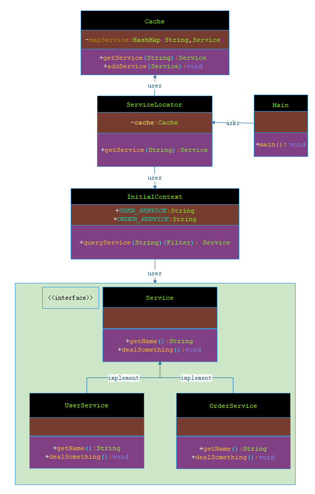

# 服务定位器模式

***

###### 服务定位器模式（Service Locator Pattern）用在我们想使用 JNDI 查询定位各种服务的时候。考虑到为某个服务查找 JNDI 的代价很高，服务定位器模式充分利用了缓存技术。在首次请求某个服务时，服务定位器在 JNDI 中查找服务，并缓存该服务对象。当再次请求相同的服务时，服务定位器会在它的缓存中查找，这样可以在很大程度上提高应用程序的性能。以下是这种设计模式的实体。

- 服务（Service）：实际处理请求的服务。对这种服务的引用可以在 JNDI 服务器中查找到。

- Context / 初始的 Context：JNDI Context 带有对要查找的服务的引用。

- 服务定位器（Service Locator）：服务定位器是通过 JNDI 查找和缓存服务来获取服务的单点接触。

- 缓存（Cache）：缓存存储服务的引用，以便复用它们。

- 客户端（Client）：Client 是通过 ServiceLocator 调用服务的对象。

***

## 实现

###### 我将创建 ServiceLocator、InitialContext、Cache、Service 作为表示实体的各种对象。Service1 和 Service2 表示实体服务。

###### Main，我们的演示类在这里是作为一个客户端，将使用 ServiceLocator 来演示服务定位器设计模式。



> 步骤 1：创建服务接口 Service。 

**Service.java**

```markdown

    package com.dao.pattern.servicelocator.interfaces;
    
    /**
     * 服务接口
     *
     * @author 阿导
     * @version 1.0
     * @fileName com.dao.pattern.servicelocator.interfaces.Service.java
     * @CopyRright (c) 2018-万物皆导
     * @created 2018-04-07 15:42:00
     */
    public interface Service {
        /**
         * 获取服务名称
         *
         * @author 阿导
         * @time 2018/4/7
         * @CopyRight 万物皆导
         * @param
         * @return java.lang.String
         */
        String getName();
        /**
         * 处理一些事情
         *
         * @author 阿导
         * @time 2018/4/7
         * @CopyRight 万物皆导
         * @param
         * @return void
         */
        void dealSomething();
    }

```

> 步骤 2：创建实体服务。

**UserService.java**

```markdown

    package com.dao.pattern.servicelocator.impl;
    
    import com.dao.pattern.servicelocator.interfaces.Service;
    
    /**
     * 用户服务
     *
     * @author 阿导
     * @version 1.0
     * @fileName com.dao.pattern.servicelocator.impl.UserService.java
     * @CopyRright (c) 2018-万物皆导
     * @created 2018-04-07 15:43:00
     */
    public class UserService implements Service {
    
        /**
         * 获取服务名称
         *
         * @return java.lang.String
         * @author 阿导
         * @time 2018/4/7
         * @CopyRight 万物皆导
         */
        @Override
        public String getName() {
            return "USER_SERVICE";
        }
    
        /**
         * 处理一些事情
         *
         * @return void
         * @author 阿导
         * @time 2018/4/7
         * @CopyRight 万物皆导
         */
        @Override
        public void dealSomething() {
            System.out.println("这里是用户服务，正在处理用户相关操作。");
        }
    }

```


**OrderService.java**

```markdown

    package com.dao.pattern.servicelocator.impl;
    
    import com.dao.pattern.servicelocator.interfaces.Service;
    
    /**
     * 订单服务
     *
     * @author 阿导
     * @version 1.0
     * @fileName com.dao.pattern.servicelocator.impl.OrderService.java
     * @CopyRright (c) 2018-万物皆导
     * @created 2018-04-07 15:44:00
     */
    public class OrderService implements Service {
    
        /**
         * 获取服务名称
         *
         * @return java.lang.String
         * @author 阿导
         * @time 2018/4/7
         * @CopyRight 万物皆导
         */
        @Override
        public String getName() {
            return "ORDER_SERVICE";
        }
    
        /**
         * 处理一些事情
         *
         * @return void
         * @author 阿导
         * @time 2018/4/7
         * @CopyRight 万物皆导
         */
        @Override
        public void dealSomething() {
            System.out.println("这里是定单服务，正在处理订单相关操作。");
        }
    }

```

> 步骤 3：为 JNDI 查询创建 InitialContext。

**InitialContext.java**

```markdown

    package com.dao.pattern.servicelocator.core;
    
    import com.dao.pattern.servicelocator.impl.OrderService;
    import com.dao.pattern.servicelocator.impl.UserService;
    import com.dao.pattern.servicelocator.interfaces.Service;
    
    /**
     * 为 JNDI 查询服务
     *
     * @author 阿导
     * @version 1.0
     * @fileName com.dao.pattern.servicelocator.core.InitialContext.java
     * @CopyRright (c) 2018-万物皆导
     * @created 2018-04-07 15:46:00
     */
    public class InitialContext {
        /**
         * 用户服务名
         */
        public static final String USER_SERVICE="USER_SERVICE";
        /**
         * 订单服务名
         */
        public static final String ORDER_SERVICE="ORDER_SERVICE";
    
        /**
         * 根据传入的服务名和存在的服务名进行对比，存在则创建
         *
         * @author 阿导
         * @time 2018/4/7
         * @CopyRight 万物皆导
         * @param jndiName
         * @return com.dao.pattern.servicelocator.interfaces.Service
         */
        public Service queryService(String jndiName){
            if(USER_SERVICE.equalsIgnoreCase(jndiName)){
                System.out.println("查询到用户服务，并创建用户服务");
                return new UserService();
            }else if (ORDER_SERVICE.equalsIgnoreCase(jndiName)){
                System.out.println("查询到订单服务，并创建订单服务");
                return new OrderService();
            }
            return null;
        }
    }

```

> 步骤 4：创建缓存 Cache。

```markdown

    package com.dao.pattern.servicelocator.core;
    
    import com.dao.pattern.servicelocator.interfaces.Service;
    
    import java.util.HashMap;
    
    /**
     * 创建缓存，存入服务名
     *
     * @author 阿导
     * @version 1.0
     * @fileName com.dao.pattern.servicelocator.core.Cache.java
     * @CopyRright (c) 2018-万物皆导
     * @created 2018-04-07 15:53:00
     */
    public class Cache {
        /**
         * 缓存集合，存储服务
         */
        private HashMap<String,Service> mapService;
        {
            mapService=new HashMap<>();
        }
    
        /**
         * 根据服务名进行查询服务
         *
         * @author 阿导
         * @time 2018/4/7
         * @CopyRight 万物皆导
         * @param serviceName
         * @return com.dao.pattern.servicelocator.interfaces.Service
         */
        public Service getService(String serviceName){
            System.out.println("。。。。。尝试从缓存获取服务。。。。。");
            return mapService.getOrDefault(serviceName,null);
        }
        /**
         * 添加服务
         *
         * @author 阿导
         * @time 2018/4/7
         * @CopyRight 万物皆导
         * @param newService
         * @return void
         */
        public void addService(Service newService){
            if(!mapService.keySet().contains(newService.getName())) {
                mapService.put(newService.getName(), newService);
            }
        }
    }


```

> 步骤 5：创建服务定位器。

**ServiceLocator.java**

```markdown

    package com.dao.pattern.servicelocator.core;
    
    import com.dao.pattern.servicelocator.interfaces.Service;
    
    /**
     * 创建服务定位器
     *
     * @author 阿导
     * @version 1.0
     * @fileName com.dao.pattern.servicelocator.core.ServiceLocator.java
     * @CopyRright (c) 2018-万物皆导
     * @created 2018-04-07 16:00:00
     */
    public class ServiceLocator {
        /**
         * 声明缓存并分配内存空间
         */
        public static Cache cache;
        static {
            cache=new Cache();
        }
        /**
         * 从服务定位器里面获取服务
         *
         * @author 阿导
         * @time 2018/4/7
         * @CopyRight 万物皆导
         * @param jndiName
         * @return com.dao.pattern.servicelocator.interfaces.Service
         */
        public static Service getService(String jndiName){
            //从缓存获取服务
            Service service = cache.getService(jndiName);
            //未获取到
            if(service==null){
                //通过 JNDI 查询服务
                InitialContext context = new InitialContext();
                service=context.queryService(jndiName);
                //若服务不为空
                if(service!=null) {
                    cache.addService(service);
                }
            }
            //返回服务
            return service;
        }
    }

```

> 步骤 6：使用 ServiceLocator 来演示服务定位器设计模式。

**Main.java**

```markdown

    package com.dao.pattern.servicelocator.main;
    
    import com.dao.pattern.servicelocator.core.InitialContext;
    import com.dao.pattern.servicelocator.core.ServiceLocator;
    import com.dao.pattern.servicelocator.interfaces.Service;
    
    /**
     * 主程序入口
     *
     * @author 阿导
     * @version 1.0
     * @fileName com.dao.pattern.servicelocator.main.Main.java
     * @CopyRright (c) 2018-万物皆导
     * @created 2018-04-07 16:05:00
     */
    public class Main {
    
        /**
         * 主程序入口
         *
         * @author 阿导
         * @time 2018/4/7
         * @CopyRight 万物皆导
         * @param args
         * @return void
         */
        public static void main(String[] args){
            //第一次获取订单服务
            Service service= ServiceLocator.getService(InitialContext.ORDER_SERVICE);
            service.dealSomething();
            //第一次获取用户服务
            service=ServiceLocator.getService(InitialContext.USER_SERVICE);
            service.dealSomething();
            //第二次获取用户服务
            service= ServiceLocator.getService(InitialContext.ORDER_SERVICE);
            service.dealSomething();
            //第二次获取订单服务
            service=ServiceLocator.getService(InitialContext.USER_SERVICE);
            service.dealSomething();
        }
    
    }
    
```

> 步骤 7：验证输出。

```markdown
    
    。。。。。尝试从缓存获取服务。。。。。
    查询到订单服务，并创建订单服务
    这里是定单服务，正在处理订单相关操作。
    。。。。。尝试从缓存获取服务。。。。。
    查询到用户服务，并创建用户服务
    这里是用户服务，正在处理用户相关操作。
    。。。。。尝试从缓存获取服务。。。。。
    这里是定单服务，正在处理订单相关操作。
    。。。。。尝试从缓存获取服务。。。。。
    这里是用户服务，正在处理用户相关操作。
    
```
