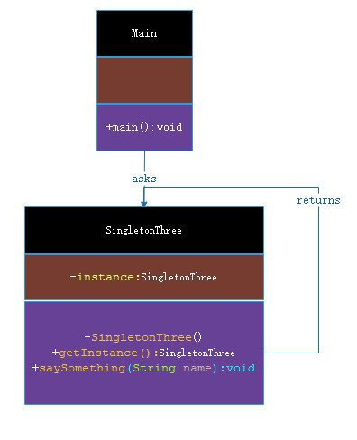

# 单例模式

***

###### 单例模式（Singleton Pattern）是 Java 中最简单的设计模式之一。这种类型的设计模式属于创建型模式，它提供了一种创建对象的最佳方式。
###### 这种模式涉及到一个单一的类，该类负责创建自己的对象，同时确保只有单个对象被创建。这个类提供了一种访问其唯一的对象的方式，可以直接访问，不需要实例化该类的对象。
###### **注意**：

> 1、单例类只能有一个实例。

> 2、单例类必须自己创建自己的唯一实例。

> 3、单例类必须给所有其他对象提供这一实例。

***

## 介绍
- **意图**：保证一个类仅有一个实例，并提供一个访问它的全局访问点。

- **主要解决**：一个全局使用的类频繁地创建与销毁。

- **何时使用**：当您想控制实例数目，节省系统资源的时候。

- **如何解决**：判断系统是否已经有这个单例，如果有则返回，如果没有则创建。

- **关键代码**：构造函数是私有的。

- **应用实例**： 

> 1、一个党只能有一个主席。

> 2、Windows 是多进程多线程的，在操作一个文件的时候，就不可避免地出现多个进程或线程同时操作一个文件的现象，所以所有文件的处理必须通过唯一的实例来进行。

> 3、一些设备管理器常常设计为单例模式，比如一个电脑有两台打印机，在输出的时候就要处理不能两台打印机打印同一个文件。

- **优点**：

> 1、在内存里只有一个实例，减少了内存的开销，尤其是频繁的创建和销毁实例（比如管理学院首页页面缓存）。

> 2、避免对资源的多重占用（比如写文件操作）。

- **缺点**：没有接口，不能继承，与单一职责原则冲突，一个类应该只关心内部逻辑，而不关心外面怎么样来实例化。

- **使用场景**：

> 1、要求生产唯一序列号。 

> 2、WEB 中的计数器，不用每次刷新都在数据库里加一次，用单例先缓存起来。 

> 3、创建的一个对象需要消耗的资源过多，比如 I/O 与数据库的连接等。

- **注意事项**：getInstance() 方法中需要使用同步锁 synchronized (Singleton.class) 防止多线程同时进入造成 instance 被多次实例化。

***

## 实现

###### 我们将创建一个 SingletonObject 类。SingletonObject 类有它的私有构造函数和本身的一个静态实例。SingletonObject 类提供了一个静态方法，供外界获取它的静态实例。Main是我的启动类，演示类使用 SingletonObject 类来获取 SingletonObject 对象。



> 步骤 1：创建一个 Singleton 类。

**SingletonThree.java**

```markdown
    
    package com.dao.pattern.singleton.demo;
    
    /**
     * 单例模式-饿汉式
     * 这种方式比较常用，但容易产生垃圾对象。
     *
     * @author 阿导
     * @version BUILD1001
     * @fileName com.dao.pattern.singleten.core.SingletonThree.java
     * @CopyRright (c) 2018-万物皆导
     * @created 2018-02-05 09:41:00
     * @modifier 阿导
     * @updated 2018-02-05 09:41:00
     */
    public class SingletonThree {
    
        /**
         * 创建一个 SingletonThree 的对象
         */
        private static SingletonThree instance=new SingletonThree();
    
        /**
         * 构造方法私有
         *
         * @author 阿导
         * @time 2018/2/5
         * @CopyRight 万物皆导
         * @return
         */
        private SingletonThree(){}
        /**
         * 获取唯一可使用的对象
         *
         * @author 阿导
         * @time 2018/2/5
         * @CopyRight 万物皆导
         * @param
         * @return com.dao.pattern.demo.SingletonThree
         */
        public static SingletonThree getInstance(){
            return instance;
        }
        /**
         * 让这个对象说些什么
         *
         * @author 阿导
         * @time 2018/2/5
         * @CopyRight 万物皆导
         * @param name
         * @return void
         */
        public void saySomething(String name){
            System.out.println("（饿汉式）您好！".concat(name));
        }
    
    }

```

> 步骤 2：从 singleton 类获取唯一的对象。

**Main.java**

```markdown
    
    package com.dao.pattern.singleton.main;
    import com.dao.pattern.singleton.core.*;
    import com.dao.pattern.singleton.demo.SingletonObject;
    
    /**
     * 主函数入口（启动类）
     *
     * @author 阿导
     * @version BUILD1001
     * @fileName com.dao.pattern.singleten.main.Main.java
     * @CopyRright (c) 2018-万物皆导
     * @created 2018-02-05 09:42:00
     * @modifier 阿导
     * @updated 2018-02-05 09:42:00
     */
    public class Main {
        /**
         * 主程序入口
         *
         * @author 阿导
         * @time 2018/1/30
         * @CopyRight 万物皆导
         * @param args
         * @return void
         */
        public static void main(String[] args){
            SingletonThree three=SingletonThree.getInstance();
            three.saySomething("万物皆导。");
        }
    }

```

> 步骤 3：验证输出。
```markdown
    您好！万物皆导。
```

***

## 单例模式的几种实现方式
###### 单例模式的实现有多种方式，如下所示：
- 1、懒汉式，线程不安全

> 是否 Lazy 初始化：是

> 是否多线程安全：否

> 实现难度：易

> 描述：这种方式是最基本的实现方式，这种实现最大的问题就是不支持多线程。因为没有加锁 synchronized，所以严格意义上它并不算单例模式。
这种方式 lazy loading 很明显，不要求线程安全，在多线程不能正常工作。

> 代码实例：

**SingletonOne.java**

```markdown
    
    package com.dao.pattern.singleton.core;
    
    /**
     * 单例模式-懒汉式，线程不安全
     * 这种方式是最基本的实现方式，这种实现最大的问题就是不支持多线程。因为没有加锁 synchronized，所以严格意义上它并不算单例模式。
     * 这种方式 lazy loading 很明显，不要求线程安全，在多线程不能正常工作。
     *
     * @author 阿导
     * @version BUILD1001
     * @fileName com.dao.pattern.singleten.core.SingletonOne.java
     * @CopyRright (c) 2018-万物皆导
     * @created 2018-02-05 09:41:00
     * @modifier 阿导
     * @updated 2018-02-05 09:41:00
     */
    public class SingletonOne {
    
        /**
         * 创建一个 SingletonOne 的对象
         */
        private static SingletonOne instance;
    
        /**
         * 构造方法私有
         *
         * @author 阿导
         * @time 2018/2/5
         * @CopyRight 万物皆导
         * @return
         */
        private SingletonOne (){}
    
        /**
         * 获取可使用的对象
         *
         * @author 阿导
         * @time 2018/2/5
         * @CopyRight 万物皆导
         * @param
         * @return com.dao.pattern.singleton.demo.SingletonOne
         */
        public static SingletonOne getInstance() {
            //判断是否存在
            if (instance == null) {
                instance = new SingletonOne();
            }
            //返回对象
            return instance;
        }
        /**
         * 让这个对象说些什么
         *
         * @author 阿导
         * @time 2018/2/5
         * @CopyRight 万物皆导
         * @param name
         * @return void
         */
        public void saySomething(String name){
            System.out.println("（懒汉式，线程不安全）您好！".concat(name));
        }
    } 

```


###### 接下来介绍的几种实现方式都支持多线程，但是在性能上有所差异。

- 2、懒汉式，线程安全

> 是否 Lazy 初始化：是

> 是否多线程安全：是

> 实现难度：易

> 描述：这种方式具备很好的 lazy loading，能够在多线程中很好的工作，但是，效率很低，99% 情况下不需要同步。

> 优点：第一次调用才初始化，避免内存浪费。

> 缺点：必须加锁 synchronized 才能保证单例，但加锁会影响效率。getInstance() 的性能对应用程序不是很关键（该方法使用不太频繁）。

> 代码实例：

**SingletonTwo.java**

```markdown
    
    package com.dao.pattern.singleton.core;
    /**
     * 单例模式-懒汉式，线程安全
     * 这种方式具备很好的 lazy loading，能够在多线程中很好的工作，但是，效率很低，99% 情况下不需要同步。
     *
     * @author 阿导
     * @version BUILD1001
     * @fileName com.dao.pattern.singleten.core.SingletonTwo.java
     * @CopyRright (c) 2018-万物皆导
     * @created 2018-02-05 09:41:00
     * @modifier 阿导
     * @updated 2018-02-05 09:41:00
     */
    public class SingletonTwo {
        /**
         * 创建一个 SingletonTwo 的对象
         */
        private static SingletonTwo instance;
    
        /**
         * 构造方法私有
         *
         * @author 阿导
         * @time 2018/2/5
         * @CopyRight 万物皆导
         * @return
         */
        private SingletonTwo (){}
    
        /**
         * 通过同步关键字-synchronized 获取可使用的对象
         *
         * @author 阿导
         * @time 2018/2/5
         * @CopyRight 万物皆导
         * @param
         * @return com.dao.pattern.singleton.demo.SingletonOne
         */
        public static synchronized SingletonTwo getInstance() {
            //判断是否存在
            if (instance == null) {
                instance = new SingletonTwo();
            }
            //返回对象
            return instance;
        }
    
        /**
         * 让这个对象说些什么
         *
         * @author 阿导
         * @time 2018/2/5
         * @CopyRight 万物皆导
         * @param name
         * @return void
         */
        public void saySomething(String name){
            System.out.println("（懒汉式，线程安全）您好！".concat(name));
        }
    } 

```

- 3、饿汉式

> 是否 Lazy 初始化：否

> 是否多线程安全：是

> 实现难度：易

> 描述：这种方式比较常用，但容易产生垃圾对象。

> 优点：没有加锁，执行效率会提高。

> 缺点：类加载时就初始化，浪费内存。它基于 classloder 机制避免了多线程的同步问题，不过，instance 在类装载时就实例化，虽然导致类装载的原因有很多种，在单例模式中大多数都是调用 getInstance 方法， 但是也不能确定有其他的方式（或者其他的静态方法）导致类装载，这时候初始化 instance 显然没有达到 lazy loading 的效果。

> 代码实例：

**SingletonThree.java**

```markdown
    
    package com.dao.pattern.singleton.core;
    
    /**
     * 单例模式-饿汉式
     * 这种方式比较常用，但容易产生垃圾对象。
     *
     * @author 阿导
     * @version BUILD1001
     * @fileName com.dao.pattern.singleten.core.SingletonThree.java
     * @CopyRright (c) 2018-万物皆导
     * @created 2018-02-05 09:41:00
     * @modifier 阿导
     * @updated 2018-02-05 09:41:00
     */
    public class SingletonThree {
    
        /**
         * 创建一个 SingletonThree 的对象
         */
        private static SingletonThree instance=new SingletonThree();
    
        /**
         * 构造方法私有
         *
         * @author 阿导
         * @time 2018/2/5
         * @CopyRight 万物皆导
         * @return
         */
        private SingletonThree(){}
        /**
         * 获取唯一可使用的对象
         *
         * @author 阿导
         * @time 2018/2/5
         * @CopyRight 万物皆导
         * @param
         * @return com.dao.pattern.demo.SingletonThree
         */
        public static SingletonThree getInstance(){
            return instance;
        }
        /**
         * 让这个对象说些什么
         *
         * @author 阿导
         * @time 2018/2/5
         * @CopyRight 万物皆导
         * @param name
         * @return void
         */
        public void saySomething(String name){
            System.out.println("（饿汉式）您好！".concat(name));
        }
    
    }

```

- 4、双检锁/双重校验锁（DCL，即 double-checked locking）

> JDK 版本：JDK1.5 起

> 是否 Lazy 初始化：是

> 是否多线程安全：是

> 实现难度：较复杂

> 描述：这种方式采用双锁机制，安全且在多线程情况下能保持高性能。getInstance() 的性能对应用程序很关键。

> 代码实例：

**SingletonFour.java**

```markdown
    
    package com.dao.pattern.singleton.core;
    /**
     * 单例模式-双检锁/双重校验锁（DCL，即 double-checked locking）
     * 这种方式采用双锁机制，安全且在多线程情况下能保持高性能。
     *
     * @author 阿导
     * @version BUILD1001
     * @fileName com.dao.pattern.singleten.core.SingletonFour.java
     * @CopyRright (c) 2018-万物皆导
     * @created 2018-02-05 09:41:00
     * @modifier 阿导
     * @updated 2018-02-05 09:41:00
     */
    public class SingletonFour {
        /**
         * 创建一个 SingletonFour 的对象，使用 volatile 关键字修饰的变量，用来确保将变量的更新操作通知到其他线程
         */
        private volatile static SingletonFour instance;
    
        /**
         * 构造方法私有
         *
         * @author 阿导
         * @time 2018/2/5
         * @CopyRight 万物皆导
         * @return
         */
        private SingletonFour() {}
    
        /**
         * 通过双检锁/双重校验锁 获取可使用的对象
         *
         * @author 阿导
         * @time 2018/2/5
         * @CopyRight 万物皆导
         * @param
         * @return com.dao.pattern.singleton.core.SingletonOne
         */
        public static SingletonFour getInstance() {
            //判断是否存在实例
            if (instance == null) {
                //同步锁限制，防止线程并发创建多个对象实例
                synchronized (SingletonFour.class) {
                    if (instance == null) {
                        instance = new SingletonFour();
                    }
                }
            }
            //返回实例
            return instance;
        }
    
    
        /**
         * 让这个对象说些什么
         *
         * @author 阿导
         * @time 2018/2/5
         * @CopyRight 万物皆导
         * @param name
         * @return void
         */
        public void saySomething(String name){
            System.out.println("（双检锁/双重校验锁）您好！".concat(name));
        }
    } 

```

- 5、登记式/静态内部类

> 是否 Lazy 初始化：是

> 是否多线程安全：是

> 实现难度：一般

> 描述：这种方式能达到双检锁方式一样的功效，但实现更简单。对静态域使用延迟初始化，应使用这种方式而不是双检锁方式。这种方式只适用于静态域的情况，双检锁方式可在实例域需要延迟初始化时使用。
这种方式同样利用了 classloder 机制来保证初始化 instance 时只有一个线程，它跟第 3 种方式不同的是：第 3 种方式只要 Singleton 类被装载了，那么 instance 就会被实例化（没有达到 lazy loading 效果），而这种方式是 Singleton 类被装载了，instance 不一定被初始化。因为 SingletonHolder 类没有被主动使用，只有通过显式调用 getInstance 方法时，才会显式装载 SingletonHolder 类，从而实例化 instance。想象一下，如果实例化 instance 很消耗资源，所以想让它延迟加载，另外一方面，又不希望在 Singleton 类加载时就实例化，因为不能确保 Singleton 类还可能在其他的地方被主动使用从而被加载，那么这个时候实例化 instance 显然是不合适的。这个时候，这种方式相比第 3 种方式就显得很合理。

> 代码实例：

**SingletonFive.java**

```markdown
    
    package com.dao.pattern.singleton.core;
    /**
     * 单例模式-登记式/静态内部类
     * 这种方式能达到双检锁方式一样的功效，但实现更简单。对静态域使用延迟初始化，应使用这种方式而不是双检锁方式。这种方式只适用于静态域的情况，双检锁方式可在实例域需要延迟初始化时使用。
     这种方式同样利用了 classloder 机制来保证初始化 instance 时只有一个线程，它跟第 3 种方式不同的是：第 3 种方式只要 Singleton 类被装载了，那么 instance 就会被实例化（没有达到 lazy loading 效果），而这种方式是 Singleton 类被装载了，instance 不一定被初始化。因为 SingletonHolder 类没有被主动使用，只有通过显式调用 getInstance 方法时，才会显式装载 SingletonHolder 类，从而实例化 instance。想象一下，如果实例化 instance 很消耗资源，所以想让它延迟加载，另外一方面，又不希望在 Singleton 类加载时就实例化，因为不能确保 Singleton 类还可能在其他的地方被主动使用从而被加载，那么这个时候实例化 instance 显然是不合适的。这个时候，这种方式相比第 3 种方式就显得很合理。
     *
     * @author 阿导
     * @version BUILD1001
     * @fileName com.dao.pattern.singleten.demo.SingletonFive.java
     * @CopyRright (c) 2018-万物皆导
     * @created 2018-02-05 09:41:00
     * @modifier 阿导
     * @updated 2018-02-05 09:41:00
     */
    public class SingletonFive {
    
        /**
         * 使用内部类创建实例
         *
         * @author 阿导
         * @time 2018/2/5
         * @CopyRight 万物皆导
         */
        private static class SingletonHolder {
            private static final SingletonFive INSTANCE = new SingletonFive();
        }
        /**
         * 构造方法私有
         *
         * @author 阿导
         * @time 2018/2/5
         * @CopyRight 万物皆导
         * @return
         */
        private SingletonFive() {}
    
        /**
         * 使用 final 关键字修饰，使其不可更改
         *
         * @author 阿导
         * @time 2018/2/5
         * @CopyRight 万物皆导
         * @param
         * @return com.dao.pattern.singleton.demo.SingletonFive
         */
        public static final SingletonFive getInstance() {
            return SingletonHolder.INSTANCE;
        }
    
    
        /**
         * 让这个对象说些什么
         *
         * @author 阿导
         * @time 2018/2/5
         * @CopyRight 万物皆导
         * @param name
         * @return void
         */
        public void saySomething(String name){
            System.out.println("（登记式/静态内部类）您好！".concat(name));
        }
    }

```


-6、枚举
> JDK 版本：JDK1.5 起

> 是否 Lazy 初始化：否

> 是否多线程安全：是

> 实现难度：易

> 描述：这种实现方式还没有被广泛采用，但这是实现单例模式的最佳方法。它更简洁，自动支持序列化机制，绝对防止多次实例化。这种方式是 Effective Java 作者 Josh Bloch 提倡的方式，它不仅能避免多线程同步问题，而且还自动支持序列化机制，防止反序列化重新创建新的对象，绝对防止多次实例化。不过，由于 JDK1.5 之后才加入 enum 特性，用这种方式写不免让人感觉生疏，在实际工作中，也很少用。
不能通过 reflection attack 来调用私有构造方法。

> 代码实例：

**SingletonSix.java**

```markdown
    
    package com.dao.pattern.singleton.core;
    /**
     * 单例模式-枚举
     * 这种方式具备很好的 lazy loading，能够在多线程中很好的工作，但是，效率很低，99% 情况下不需要同步。
     *
     * @author 阿导
     * @version BUILD1001
     * @fileName com.dao.pattern.singleten.demo.SingletonTwo.java
     * @CopyRright (c) 2018-万物皆导
     * @created 2018-02-05 09:41:00
     * @modifier 阿导
     * @updated 2018-02-05 09:41:00
     */
    public enum SingletonSix {
        INSTANCE;  
    
        /**
         * 让这个对象说些什么
         *
         * @author 阿导
         * @time 2018/2/5
         * @CopyRight 万物皆导
         * @param name
         * @return void
         */
        public void saySomething(String name){
            System.out.println("（枚举）您好！".concat(name));
        }
    } 

```
 
### **经验之谈**：一般情况下，不建议使用第 1 种和第 2 种懒汉方式，建议使用第 3 种饿汉方式。只有在要明确实现 lazy loading 效果时，才会使用第 5 种登记方式。如果涉及到反序列化创建对象时，可以尝试使用第 6 种枚举方式。如果有其他特殊的需求，可以考虑使用第 4 种双检锁方式。
