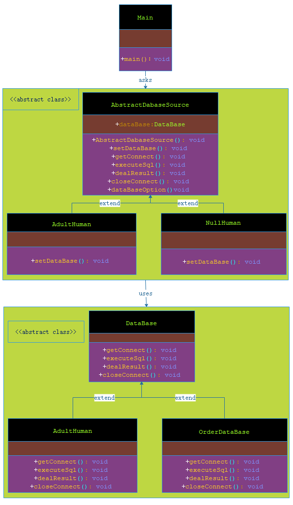

# 模板模式

***

###### 在模板模式（Template Pattern）中，一个抽象类公开定义了执行它的方法的方式/模板。它的子类可以按需要重写方法实现，但调用将以抽象类中定义的方式进行。这种类型的设计模式属于行为型模式。

***

## 介绍

- **意图**：定义一个操作中的算法的骨架，而将一些步骤延迟到子类中。模板方法使得子类可以不改变一个算法的结构即可重定义该算法的某些特定步骤。

- **主要解决**：一些方法通用，却在每一个子类都重新写了这一方法。

- **何时使用**：有一些通用的方法。

- **如何解决**：将这些通用算法抽象出来。

- **关键代码**：在抽象类实现，其他步骤在子类实现。

- **应用实例**： 

> 1、在造房子的时候，地基、走线、水管都一样，只有在建筑的后期才有加壁橱加栅栏等差异。 

> 2、西游记里面菩萨定好的 81 难，这就是一个顶层的逻辑骨架。 

> 3、spring 中对 Hibernate 的支持，将一些已经定好的方法封装起来，比如开启事务、获取 Session、关闭 Session 等，程序员不重复写那些已经规范好的代码，直接丢一个实体就可以保存。

- **优点**： 

> 1、封装不变部分，扩展可变部分。 

> 2、提取公共代码，便于维护。 

> 3、行为由父类控制，子类实现。

- **缺点**：每一个不同的实现都需要一个子类来实现，导致类的个数增加，使得系统更加庞大。

- **使用场景**： 

> 1、有多个子类共有的方法，且逻辑相同。 

> 2、重要的、复杂的方法，可以考虑作为模板方法。

- **注意事项**：为防止恶意操作，一般模板方法都加上 final 关键词。

***

## 实现

###### 我将创建一个定义操作的 AbstractDabaseSource 抽象类，其中，模板方法设置为 final，这样它就不会被重写。UserDao 和 OrderDao 是扩展了 AbstractDabaseSource 的实体类，它们重写了抽象类的方法。

###### 顶一个抽象类 DataBase 模拟数据源，继承其子类的 UserDataBase 和 OrderDataBase 分别模拟用户库和订单库。

###### Main，我的演示类使用 AbstractDabaseSource 来演示模板模式的用法。



> 步骤 1：模拟数据源，创建抽象类 DataBase 和 其子类

**DataBase.java**

```markdown

    package com.dao.pattern.template.vo;
    
    /**
     * 模拟数据库
     *
     * @author 阿导
     * @version 1.0
     * @fileName com.dao.pattern.template.vo.DataBase.java
     * @CopyRright (c) 2018-万物皆导
     * @created 2018-04-02 20:12:00
     */
    public abstract class DataBase {
    
        /**
         * 链接到数据库
         *
         * @author 阿导
         * @time 2018/4/2
         * @CopyRight 万物皆导
         * @return void
         */
        public abstract void getConnect();
    
        /**
         * 执行 sql
         *
         * @author 阿导
         * @time 2018/4/2
         * @CopyRight 万物皆导
         * @param
         * @return void
         */
        public abstract void executeSql();
    
        /**
         * 处理结果
         *
         * @author 阿导
         * @time 2018/4/2
         * @CopyRight 万物皆导
         * @param
         * @return void
         */
        public abstract void dealResult();
    
        /**
         * 关闭链接
         * @author 阿导
         * @time 2018/4/2
         * @CopyRight 万物皆导
         * @param
         * @return void
         */
        public abstract void closeConnect();
    }

```


**OrderDataBase.java**

```markdown
    
    package com.dao.pattern.template.vo;
    
    /**
     * 订单库
     *
     * @author 阿导
     * @version 1.0
     * @fileName com.dao.pattern.template.vo.OrderDataBase.java
     * @CopyRright (c) 2018-万物皆导
     * @created 2018-04-02 20:14:00
     */
    public class OrderDataBase extends DataBase {
    
    
        /**
         * 链接到数据库
         *
         * @return void
         * @author 阿导
         * @time 2018/4/2
         * @CopyRight 万物皆导
         */
        @Override
        public void getConnect() {
            System.out.println("1.获取订单库的数据库链接");
        }
    
        /**
         * 执行 sql
         *
         * @return void
         * @author 阿导
         * @time 2018/4/2
         * @CopyRight 万物皆导
         */
        @Override
        public void executeSql() {
            System.out.println("2.执行订单库的 SQL");
        }
    
        /**
         * 处理结果
         *
         * @return void
         * @author 阿导
         * @time 2018/4/2
         * @CopyRight 万物皆导
         */
        @Override
        public void dealResult() {
            System.out.println("3.处理订单库执行后的操作");
        }
    
        /**
         * 关闭链接
         *
         * @return void
         * @author 阿导
         * @time 2018/4/2
         * @CopyRight 万物皆导
         */
        @Override
        public void closeConnect() {
            System.out.println("4.关闭订单库的数据库链接");
        }
    }

```


**UserDataBase.java**

```markdown
    
    package com.dao.pattern.template.vo;
    
    /**
     * 用户库
     *
     * @author 阿导
     * @version 1.0
     * @fileName com.dao.pattern.template.vo.UserDataBase.java
     * @CopyRright (c) 2018-万物皆导
     * @created 2018-04-02 20:13:00
     */
    public class UserDataBase extends DataBase {
    
        /**
         * 链接到数据库
         *
         * @return void
         * @author 阿导
         * @time 2018/4/2
         * @CopyRight 万物皆导
         */
        @Override
        public void getConnect() {
            System.out.println("1.获取用户库的数据库链接");
        }
    
        /**
         * 执行 sql
         *
         * @return void
         * @author 阿导
         * @time 2018/4/2
         * @CopyRight 万物皆导
         */
        @Override
        public void executeSql() {
            System.out.println("2.执行用户库的 SQL");
        }
    
        /**
         * 处理结果
         *
         * @return void
         * @author 阿导
         * @time 2018/4/2
         * @CopyRight 万物皆导
         */
        @Override
        public void dealResult() {
            System.out.println("3.处理用户库执行后的操作");
        }
    
        /**
         * 关闭链接
         *
         * @return void
         * @author 阿导
         * @time 2018/4/2
         * @CopyRight 万物皆导
         */
        @Override
        public void closeConnect() {
            System.out.println("4.关闭用户库的数据库链接");
        }
    }

```

> 步骤 2：创建一个抽象类，它的模板方法被设置为 final。

**AbstractDabaseSource.java**

```markdown
    
    package com.dao.pattern.template.core;
    
    import com.dao.pattern.template.vo.DataBase;
    
    /**
     * 数据源
     *
     * @author 阿导
     * @version 1.0
     * @fileName com.dao.pattern.template.core.AbstractDabaseSource.java
     * @CopyRright (c) 2018-万物皆导
     * @created 2018-04-02 20:08:00
     */
    public abstract class AbstractDabaseSource {
        /**
         * 数据源
         */
        protected DataBase dataBase;
    
        /**
         * 链接到数据库
         *
         * @author 阿导
         * @time 2018/4/2
         * @CopyRight 万物皆导
         * @return void
         */
        protected  void getConnect(){
            dataBase.getConnect();
        }
    
        /**
         * 执行 sql
         *
         * @author 阿导
         * @time 2018/4/2
         * @CopyRight 万物皆导
         * @param
         * @return void
         */
        protected  void executeSql(){
            dataBase.executeSql();
        }
    
        /**
         * 处理结果
         *
         * @author 阿导
         * @time 2018/4/2
         * @CopyRight 万物皆导
         * @param
         * @return void
         */
        protected  void dealResult(){
            dataBase.dealResult();
        }
    
        /**
         * 关闭链接
         * @author 阿导
         * @time 2018/4/2
         * @CopyRight 万物皆导
         * @param
         * @return void
         */
        protected  void closeConnect(){
            dataBase.closeConnect();
        }
    
        /**
         * 模板应该用关键字 final 修饰
         * @author 阿导
         * @time 2018/4/2
         * @CopyRight 万物皆导
         * @param
         * @return void
         */
        public final void dataBaseOption(){
            //获取链接
            this.getConnect();
            //执行 sql
            this.executeSql();
            //处理结果
            this.dealResult();
            //关闭连接
            this.closeConnect();
        }
    
        /**
         * 数据源注入
         *
         * @author 阿导
         * @time 2018/4/2
         * @CopyRight 万物皆导
         * @param
         * @return void
         */
        protected abstract void setDataBase();
    
        /**
         * 构造方法动态注入数据源
         *
         * @author 阿导
         * @time 2018/4/2
         * @CopyRight 万物皆导
         * @return
         */
        public AbstractDabaseSource() {
            this.setDataBase();
        }
    }

```

> 步骤 3：创建扩展了上述类的实体类。

**UserDao.java**

```markdown
    
    package com.dao.pattern.template.mapper;
    
    import com.dao.pattern.template.core.AbstractDabaseSource;
    import com.dao.pattern.template.vo.DataBase;
    import com.dao.pattern.template.vo.UserDataBase;
    
    /**
     * 用户库数据访问层
     *
     * @author 阿导
     * @version 1.0
     * @fileName com.dao.pattern.template.mapper.UserDao.java
     * @CopyRright (c) 2018-万物皆导
     * @created 2018-04-02 20:30:00
     */
    public class UserDao extends AbstractDabaseSource{
    
        /**
         * 模拟数据源注入
         *
         * @author 阿导
         * @time 2018/4/2
         * @CopyRight 万物皆导
         * @param
         * @return void
         */
        @Override
        protected void setDataBase() {
            this.dataBase=new UserDataBase();
        }
    }

```


**OrderDao.java**

```markdown

    package com.dao.pattern.template.mapper;
    
    import com.dao.pattern.template.core.AbstractDabaseSource;
    import com.dao.pattern.template.vo.DataBase;
    import com.dao.pattern.template.vo.OrderDataBase;
    
    /**
     * 用户库数据访问层
     *
     * @author 阿导
     * @version 1.0
     * @fileName com.dao.pattern.template.mapper.OrderDao.java
     * @CopyRright (c) 2018-万物皆导
     * @created 2018-04-02 20:32:00
     */
    public class OrderDao extends AbstractDabaseSource {
    
    
        /**
         * 模拟数据源注入
         *
         * @author 阿导
         * @time 2018/4/2
         * @CopyRight 万物皆导
         * @param
         * @return void
         */
        @Override
        protected void setDataBase() {
            this.dataBase=new OrderDataBase();
        }
    }

```

> 步骤 4：测试类 MyTest 来演示模板模式

**Main.java**

```markdown

   package com.dao.pattern.template.main;
   
   import com.dao.pattern.template.core.AbstractDabaseSource;
   import com.dao.pattern.template.mapper.OrderDao;
   import com.dao.pattern.template.mapper.UserDao;
   
   /**
    * 主程序入口
    *
    * @author 阿导
    * @version 1.0
    * @fileName com.dao.pattern.template.main.Main.java
    * @CopyRright (c) 2018-万物皆导
    * @created 2018-04-02 21:45:00
    */
   public class Main {
   
       /**
        * 主程序入口
        * 
        * @author 阿导
        * @time 2018/4/2
        * @CopyRight 万物皆导
        * @param args
        * @return void
        */
       public static void main(String[] args){
           //声明用户库的数据访问层
           AbstractDabaseSource userDao=new UserDao();
           //声明订单库的数据访问层
           AbstractDabaseSource orderDao=new OrderDao();
           //用户库的操作
           System.out.println("============用户库的操作===============");
           userDao.dataBaseOption();
           //订单库的操作
           System.out.println("============订单库的操作===============");
           orderDao.dataBaseOption();
       }
   }


```

> 步骤 5：验证输出。

```markdown
    
    ============用户库的操作===============
    1.获取用户库的数据库链接
    2.执行用户库的 SQL
    3.处理用户库执行后的操作
    4.关闭用户库的数据库链接
    ============订单库的操作===============
    1.获取订单库的数据库链接
    2.执行订单库的 SQL
    3.处理订单库执行后的操作
    4.关闭订单库的数据库链接
    
```
