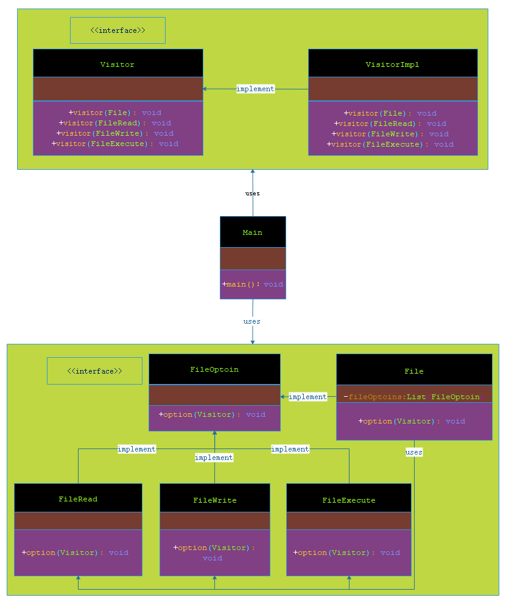

# 访问者模式

***

###### 在访问者模式（Visitor Pattern）中，我们使用了一个访问者类，它改变了元素类的执行算法。通过这种方式，元素的执行算法可以随着访问者改变而改变。这种类型的设计模式属于行为型模式。根据模式，元素对象已接受访问者对象，这样访问者对象就可以处理元素对象上的操作。

***

## 介绍

- **意图**：主要将数据结构与数据操作分离。

- **主要解决**：稳定的数据结构和易变的操作耦合问题。

- **何时使用**：需要对一个对象结构中的对象进行很多不同的并且不相关的操作，而需要避免让这些操作"污染"这些对象的类，使用访问者模式将这些封装到类中。

- **如何解决**：在被访问的类里面加一个对外提供接待访问者的接口。

- **关键代码**：在数据基础类里面有一个方法接受访问者，将自身引用传入访问者。

- **应用实例**：您在朋友家做客，您是访问者，朋友接受您的访问，您通过朋友的描述，然后对朋友的描述做出一个判断，这就是访问者模式。

- **优点**： 

> 1、符合单一职责原则。 

> 2、优秀的扩展性。 

> 3、灵活性。

- **缺点**： 

> 1、具体元素对访问者公布细节，违反了迪米特原则。 

> 2、具体元素变更比较困难。 

> 3、违反了依赖倒置原则，依赖了具体类，没有依赖抽象。

- **使用场景**： 

> 1、对象结构中对象对应的类很少改变，但经常需要在此对象结构上定义新的操作。 

> 2、需要对一个对象结构中的对象进行很多不同的并且不相关的操作，而需要避免让这些操作"污染"这些对象的类，也不希望在增加新操作时修改这些类。

- **注意事项**：访问者可以对功能进行统一，可以做报表、UI、拦截器与过滤器。

***

## 实现

###### 我们将创建一个定义接受操作的 FileOptoin 接口。FileRead、FileWrite、FileExecute 和 File 是实现了 FileOptoin 接口的实体类。我们将定义另一个接口 Visitor，它定义了访问者类的操作。File 使用实体访问者来执行相应的动作。

###### Main，我们的演示类使用 File、Visitor 类来演示访问者模式的用法。



> 步骤 1：定义一个表示元素的接口。

**FileOptoin.java**

```markdown
    
    package com.dao.pattern.visitor.interfaces;
    
    import com.dao.pattern.visitor.core.Visitor;
    
    /**
     * 文件操作
     *
     * @author 阿导
     * @version 1.0
     * @fileName com.dao.pattern.visitor.interfaces.FileOptoin.java
     * @CopyRright (c) 2018-万物皆导
     * @created 2018-04-03 08:36:00
     */
    public interface FileOptoin {
        /**
         * 文件操作
         *
         * @author 阿导
         * @time 2018/4/3
         * @CopyRight 万物皆导
         * @param visitor
         * @return void
         */
        void option(Visitor visitor);
    }

```
> 步骤 2：创建扩展了上述类的实体类。

**File.java**

```markdown
    
    package com.dao.pattern.visitor.impl;
    
    import com.dao.pattern.visitor.core.Visitor;
    import com.dao.pattern.visitor.interfaces.FileOptoin;
    
    import java.util.ArrayList;
    import java.util.Arrays;
    import java.util.List;
    
    /**
     * 文件
     *
     * @author 阿导
     * @version 1.0
     * @fileName com.dao.pattern.visitor.impl.File.java
     * @CopyRright (c) 2018-万物皆导
     * @created 2018-04-03 08:46:00
     */
    public class File implements FileOptoin {
        /**
         * 文件的操作集合
         */
        private List<FileOptoin> fileOptoins;
    
        //集合内容添加
        {
            fileOptoins=new ArrayList<>();
            fileOptoins.addAll(Arrays.asList(new FileOptoin[]{new FileRead(),new FileWrite(),new FileExecute()}));
        }
    
        /**
         * 文件操作
         *
         * @author 阿导
         * @time 2018/4/3
         * @CopyRight 万物皆导
         * @param visitor
         * @return void
         */
        @Override
        public void option(Visitor visitor) {
            fileOptoins.forEach(fileOptoin -> fileOptoin.option(visitor));
            visitor.visitor(this);
        }
    }


```

**FileRead.java**

```markdown

    package com.dao.pattern.visitor.impl;
    
    import com.dao.pattern.visitor.core.Visitor;
    import com.dao.pattern.visitor.interfaces.FileOptoin;
    
    /**
     * 读文件
     *
     * @author 阿导
     * @version 1.0
     * @fileName com.dao.pattern.visitor.impl.FileRead.java
     * @CopyRright (c) 2018-万物皆导
     * @created 2018-04-03 08:36:00
     */
    public class FileRead implements FileOptoin {
    
        /**
         * 文件读取
         *
         * @param visitor
         * @return void
         * @author 阿导
         * @time 2018/4/3
         * @CopyRight 万物皆导
         */
        @Override
        public void option(Visitor visitor) {
            visitor.visitor(this);
        }
    }

```

**FileWrite.java**

```markdown

    package com.dao.pattern.visitor.impl;
    
    import com.dao.pattern.visitor.core.Visitor;
    import com.dao.pattern.visitor.interfaces.FileOptoin;
    
    /**
     * 写文件
     *
     * @author 阿导
     * @version 1.0
     * @fileName com.dao.pattern.visitor.impl.FileWrite.java
     * @CopyRright (c) 2018-万物皆导
     * @created 2018-04-03 08:37:00
     */
    public class FileWrite  implements FileOptoin {
    
        /**
         * 文件写入
         *
         * @param visitor
         * @return void
         * @author 阿导
         * @time 2018/4/3
         * @CopyRight 万物皆导
         */
        @Override
        public void option(Visitor visitor) {
            visitor.visitor(this);
        }
    }

    
```

**FileExecute.java**

```markdown

    package com.dao.pattern.visitor.impl;
    
    import com.dao.pattern.visitor.core.Visitor;
    import com.dao.pattern.visitor.interfaces.FileOptoin;
    
    /**
     * 执行文件
     *
     * @author 阿导
     * @version 1.0
     * @fileName com.dao.pattern.visitor.impl.FileExecute.java
     * @CopyRright (c) 2018-万物皆导
     * @created 2018-04-03 08:37:00
     */
    public class FileExecute  implements FileOptoin {
    
        /**
         * 文件执行
         *
         * @param visitor
         * @return void
         * @author 阿导
         * @time 2018/4/3
         * @CopyRight 万物皆导
         */
        @Override
        public void option(Visitor visitor) {
            visitor.visitor(this);
        }
    }


```

> 步骤 3：定义一个表示访问者的接口。

**Visitor.java**

```markdown

    package com.dao.pattern.visitor.core;
    
    import com.dao.pattern.visitor.impl.File;
    import com.dao.pattern.visitor.impl.FileExecute;
    import com.dao.pattern.visitor.impl.FileRead;
    import com.dao.pattern.visitor.impl.FileWrite;
    
    /**
     * 访问者
     *
     * @author 阿导
     * @version 1.0
     * @fileName com.dao.pattern.visitor.core.Visitor.java
     * @CopyRright (c) 2018-万物皆导
     * @created 2018-04-03 08:41:00
     */
    public interface Visitor {
        /**
         * 文件
         *
         * @author 阿导
         * @time 2018/4/3
         * @CopyRight 万物皆导
         * @param file
         * @return void
         */
        void visitor(File file);
        /**
         * 读文件
         *
         * @author 阿导
         * @time 2018/4/3
         * @CopyRight 万物皆导
         * @param fileRead
         * @return void
         */
        void visitor(FileRead fileRead);
        /**
         * 写文件
         *
         * @author 阿导
         * @time 2018/4/3
         * @CopyRight 万物皆导
         * @param fileWrite
         * @return void
         */
        void visitor(FileWrite fileWrite);
        /**
         * 执行文件
         *
         * @author 阿导
         * @time 2018/4/3
         * @CopyRight 万物皆导
         * @param fileExecute
         * @return void
         */
        void visitor(FileExecute fileExecute);
    }
   
```

> 步骤 4：创建实现了上述类的实体访问者。

**VisitorImpl.java**

```markdown
    
    package com.dao.pattern.visitor.core;
    
    import com.dao.pattern.visitor.impl.File;
    import com.dao.pattern.visitor.impl.FileExecute;
    import com.dao.pattern.visitor.impl.FileRead;
    import com.dao.pattern.visitor.impl.FileWrite;
    
    /**
     * 访问者实现
     *
     * @author 阿导
     * @version 1.0
     * @fileName com.dao.pattern.visitor.core.VisitorImpl.java
     * @CopyRright (c) 2018-万物皆导
     * @created 2018-04-03 09:03:00
     */
    public class VisitorImpl implements Visitor {
    
        /**
         * 文件
         *
         * @param file
         * @return void
         * @author 阿导
         * @time 2018/4/3
         * @CopyRight 万物皆导
         */
        @Override
        public void visitor(File file) {
            System.out.println("结束文件操作。。。。");
        }
    
        /**
         * 读文件
         *
         * @param fileRead
         * @return void
         * @author 阿导
         * @time 2018/4/3
         * @CopyRight 万物皆导
         */
        @Override
        public void visitor(FileRead fileRead) {
            System.out.println("正在读取文件。。。。");
        }
    
        /**
         * 写文件
         *
         * @param fileWrite
         * @return void
         * @author 阿导
         * @time 2018/4/3
         * @CopyRight 万物皆导
         */
        @Override
        public void visitor(FileWrite fileWrite) {
            System.out.println("正在写入文件。。。。");
        }
    
        /**
         * 执行文件
         *
         * @param fileExecute
         * @return void
         * @author 阿导
         * @time 2018/4/3
         * @CopyRight 万物皆导
         */
        @Override
        public void visitor(FileExecute fileExecute) {
            System.out.println("正在执行文件。。。。");
        }
    }

```

> 步骤 5：使用 Visitor 来显示 File 的组成部分。

**Main.java**

```markdown

    package com.dao.pattern.visitor.main;
    
    import com.dao.pattern.visitor.core.VisitorImpl;
    import com.dao.pattern.visitor.impl.File;
    
    /**
     * 主程序入口
     *
     * @author 阿导
     * @version 1.0
     * @fileName com.dao.pattern.visitor.main.Main.java
     * @CopyRright (c) 2018-万物皆导
     * @created 2018-04-03 09:06:00
     */
    public class Main {
    
        /**
         * 主程序入口
         *
         * @author 阿导
         * @time 2018/4/3
         * @CopyRight 万物皆导
         * @param args
         * @return void
         */
        public static void main(String[] args){
            new File().option(new VisitorImpl());
        }
    }

```

> 步骤 6：验证输出。

```markdown
    
    正在读取文件。。。。
    正在写入文件。。。。
    正在执行文件。。。。
    结束文件操作。。。。
    
```
